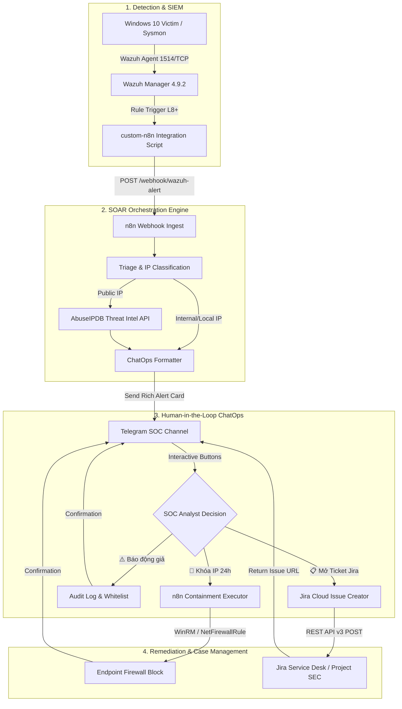

# Wazuh SOAR & SecOps Automation with n8n

Tài liệu hướng dẫn triển khai, cấu hình và vận hành hệ thống **SOAR (Security Orchestration, Automation and Response)** kết nối trực tiếp **Wazuh SIEM Manager** với **n8n Automation Engine**, **Telegram ChatOps (2 chiều - Human-in-the-Loop)**, **AbuseIPDB Threat Intelligence**, và **Jira Cloud Case Management**.

---

## 1. Kiến trúc tổng thể (Architecture Overview)



---

## 2. Các thành phần và Thư mục

| File / Thư mục | Chức năng | Vị trí triển khai |
| :--- | :--- | :--- |
| `custom-n8n` | Bash wrapper script kích hoạt bởi Wazuh daemon | `/var/ossec/integrations/custom-n8n` |
| `custom-n8n.py` | Python script chuẩn hóa alert JSON và gửi tới Webhook | `/var/ossec/integrations/custom-n8n.py` |
| `workflows/01_wazuh_soar_threat_enrichment.json` | Workflow 1: Tiếp nhận cảnh báo, tra cứu AbuseIPDB và gửi nút bấm về Telegram | Import vào n8n Web UI |
| `workflows/02_containment_action_executor.json` | Workflow 2: Tiếp nhận callback nút bấm (Khóa IP / Báo động giả / Mở Ticket Jira) | Import vào n8n Web UI |
| `workflows/03_scheduled_healthcheck_cron.json` | Workflow 3: Cron định kỳ 6h kiểm tra trạng thái sức khỏe toàn bộ SOC Lab | Import vào n8n Web UI |
| `deployment/docker-compose-n8n.yml` | File cấu hình Docker n8n chạy trên Wazuh VM | `~/n8n-docker/docker-compose.yml` |

---

## 3. Cấu hình Wazuh Manager Integration

Cấu hình khối `<integration>` trong `/var/ossec/etc/ossec.conf` trên Wazuh Manager:

```xml
  <!-- SOAR Workflow Automation Integration (n8n Engine) -->
  <integration>
    <name>custom-n8n</name>
    <hook_url>http://192.168.71.128:5678/webhook/wazuh-alert</hook_url>
    <rule_id>100001, 100002, 100004, 100005, 100006, 100007, 87105</rule_id>
    <alert_format>json</alert_format>
  </integration>
```

Khởi động lại Wazuh Manager để nạp cấu hình:
```bash
docker exec -it single-node-wazuh.manager-1 /var/ossec/bin/wazuh-control restart
```

---

## 4. Tích hợp Jira Cloud Case Management

Hệ thống SOAR hỗ trợ nút bấm **`[📋 Mở Ticket Jira]`**, tự động tạo Issue trên Jira Cloud REST API v3 mà không cần analyst phải đăng nhập thủ công:

### 4.1. Tạo API Token trên Atlassian
1. Truy cập: [https://id.atlassian.com/manage-profile/security/api-tokens](https://id.atlassian.com/manage-profile/security/api-tokens)
2. Nhấn **Create API token** $\rightarrow$ Đặt tên `Wazuh-SOAR-n8n` $\rightarrow$ Copy Token.

### 4.2. Cấu hình Biến Môi trường trong n8n
Thêm các biến môi trường vào `deployment/docker-compose-n8n.yml` hoặc n8n Settings:
- `JIRA_DOMAIN`: Tên miền Atlassian của bạn (VD: `soc-lab` ứng với `soc-lab.atlassian.net`)
- `JIRA_EMAIL`: Email tài khoản Atlassian (VD: `analyst@company.com`)
- `JIRA_API_TOKEN`: API Token vừa tạo
- `JIRA_PROJECT_KEY`: Mã Project quản lý sự cố (VD: `SEC` hoặc `SOC`)

### 4.3. Định dạng Payload Jira REST API v3
Khi analyst bấm nút trên Telegram, n8n thực thi request:
- **Endpoint:** `POST https://<JIRA_DOMAIN>.atlassian.net/rest/api/3/issue`
- **Headers:**
  - `Authorization: Basic <base64(JIRA_EMAIL:JIRA_API_TOKEN)>`
  - `Content-Type: application/json`
- **Fields:**
  - `summary`: `[Wazuh SOAR Incident] Threat Detected on <Attacker_IP>`
  - `issuetype`: `Task` / `Incident`
  - `priority`: `High`

Sau khi tạo thành công, n8n trả về trực tiếp link `https://<JIRA_DOMAIN>.atlassian.net/browse/<KEY>` lên Telegram.

---

## 5. Hướng dẫn Import và Kích hoạt Workflows

1. Truy cập giao diện n8n: `http://192.168.71.128:5678`
2. Tạo tài khoản quản trị đầu tiên (nếu lần đầu truy cập).
3. Nhấn **Add workflow** $\rightarrow$ Menu $\rightarrow$ **Import from File...**
4. Chọn lần lượt 3 file trong thư mục `integrations/n8n/workflows/`:
   - `01_wazuh_soar_threat_enrichment.json`
   - `02_containment_action_executor.json`
   - `03_scheduled_healthcheck_cron.json`
5. Bật nút gạt **Active** ở góc trên bên phải của mỗi workflow để bắt đầu lắng nghe sự kiện.

---

## 6. Kiểm tra & Tái hiện (Verification)

Chạy kịch bản kiểm thử E2E tự động từ máy trạm:

```powershell
python tests/e2e/test_soar_webhook.py
```

Kết quả kiểm thử tiêu chuẩn:
```text
=================================================================
  WAZUH SOAR / n8n / TELEGRAM CHATOPS AUTOMATION E2E TEST
=================================================================
[*] Step 1: Checking n8n container health at http://192.168.71.128:5678...
  [+] PASS: n8n Engine is UP (HTTP 200)
[*] Step 2: Testing local 'custom-n8n.py' parser and dispatch logic...
  [+] Script executed with returncode 0
[*] Step 3: Testing ChatOps Callback Webhook at http://192.168.71.128:5678/webhook/telegram-callback...
  [+] Callback Webhook responded with HTTP 200
=================================================================
  [SUCCESS] ALL SOAR / N8N PIPELINE INTEGRATION TESTS PASSED (PASS)
=================================================================
```
