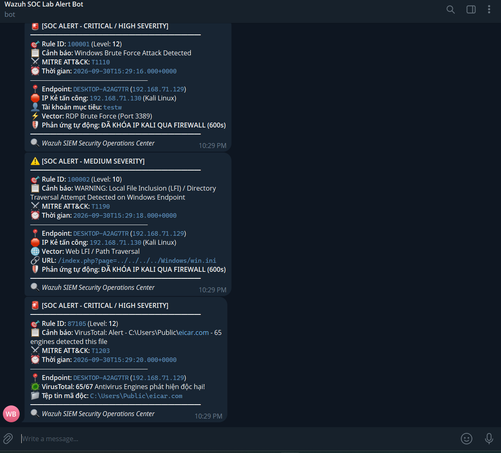

# 📱 TÍCH HỢP CHATOPS: BẮN CẢNH BÁO TỰ ĐỘNG VỀ TELEGRAM (WAZUH SIEM)

Tài liệu này hướng dẫn cách kết nối hệ thống **Wazuh Manager** với ứng dụng **Telegram** để tự động gửi thông báo cứu cánh (SOC Alert) kèm đầy đủ thông tin: IP tấn công, Mức độ nghiêm trọng, MITRE ATT&CK và trạng thái phản ứng Active Response của tường lửa.

---

## 📌 1. NGUYÊN LÝ HOẠT ĐỘNG (CHATOPS PIPELINE)

```
 [Sự kiện Tấn công] (RDP Brute Force, Web LFI, File mã độc)
         │
         ▼
 [Wazuh Manager]
         │
         │ (1) Khớp Rule 100001 / 100002 / 87105
         ▼
 [wazuh-integratord]
         │
         │ (2) Chuyển alert JSON qua script /var/ossec/integrations/custom-telegram
         ▼
 [custom-telegram.py]
         │
         │ (3) Định dạng tin nhắn HTML chuyên nghiệp & gửi qua Telegram Bot API
         ▼
 [Kênh Telegram SOC Team]
   Nhận thông báo ngay lập tức trên điện thoại / máy tính (< 1 giây)
```

---

## 🤖 2. BƯỚC 1: TẠO TELEGRAM BOT & LẤY CHAT ID (2 PHÚT)

### 2.1. Tạo Bot Telegram để lấy `BOT_TOKEN`:
1. Mở ứng dụng Telegram, tìm kiếm bot chính thức: **`@BotFather`** (có tích xanh).
2. Nhấn **Start** và gửi lệnh: `/newbot`
3. Nhập tên hiển thị cho bot (ví dụ: `Wazuh SOC Lab Alert Bot`).
4. Nhập username kết thúc bằng `bot` (ví dụ: `my_wazuh_soc_alert_bot`).
5. `@BotFather` sẽ gửi lại cho bạn chuỗi **HTTP API Token** (dạng `1234567890:ABCdefGhIJKlmNoPQRsTUVwxyZ`).

### 2.2. Lấy `CHAT_ID` nhận tin nhắn:
1. Nhấp vào đường link bot vừa tạo (ví dụ: `t.me/my_wazuh_soc_alert_bot`) và nhấn **Start** (bắt buộc phải Start bot).
2. Tìm bot: **`@userinfobot`**, nhấn **Start** -> Bot sẽ trả về số **`Id`** của bạn (ví dụ: `987654321`).
   > *Mẹo:* Nếu muốn gửi vào một Group: Thêm bot của bạn vào Group, gửi 1 tin nhắn bất kỳ, sau đó mở trình duyệt truy cập: `https://api.telegram.org/bot<TOKEN>/getUpdates` để tìm chuỗi `"chat":{"id": -100xxxxxxxxxx}`.

---

## 🧪 3. BƯỚC 2: ĐIỀN CẤU HÌNH VÀO `.env` & KIỂM THỬ TRỰC TIẾP

1. Mở file `.env` tại thư mục gốc của dự án và điền:
   ```text
   TELEGRAM_BOT_TOKEN=1234567890:ABCdefGhIJKlmNoPQRsTUVwxyZ
   TELEGRAM_CHAT_ID=987654321
   ```
2. Chạy tool kiểm thử có sẵn để bắn thử thông báo:
   ```powershell
   # Bắn thử cảnh báo RDP Brute Force:
   python integrations/telegram/test_telegram_alert.py --scenario rdp

   # Bắn thử cảnh báo Web LFI:
   python integrations/telegram/test_telegram_alert.py --scenario lfi

   # Bắn thử cảnh báo VirusTotal:
   python integrations/telegram/test_telegram_alert.py --scenario virustotal
   ```
   *Kiểm tra ứng dụng Telegram trên máy của bạn sẽ thấy ngay thông báo đẹp mắt.*



## ⚙️ 4. BƯỚC 3: CÀI ĐẶT LÊN WAZUH MANAGER

### 4.1. Đẩy script tích hợp vào container `wazuh.manager`
Từ máy Host, copy 2 file tích hợp vào thư mục `/var/ossec/integrations/` của Manager:

```powershell
# Copy qua SSH vào Ubuntu rồi nạp vào Docker:
scp integrations/telegram/custom-telegram integrations/telegram/custom-telegram.py wazuh-vm:/tmp/
ssh wazuh-vm "docker cp /tmp/custom-telegram single-node-wazuh.manager-1:/var/ossec/integrations/; docker cp /tmp/custom-telegram.py single-node-wazuh.manager-1:/var/ossec/integrations/; docker exec single-node-wazuh.manager-1 chmod 750 /var/ossec/integrations/custom-telegram /var/ossec/integrations/custom-telegram.py; docker exec single-node-wazuh.manager-1 chown root:wazuh /var/ossec/integrations/custom-telegram /var/ossec/integrations/custom-telegram.py"
```

### 4.2. Khai báo khối `<integration>` trong `ossec.conf`
Mở `/var/ossec/etc/ossec.conf` trên Manager và bổ sung khối tích hợp:

```xml
  <!-- Tích hợp ChatOps cảnh báo thời gian thực về Telegram -->
  <integration>
    <name>custom-telegram</name>
    <api_key>YOUR_TELEGRAM_BOT_TOKEN</api_key>
    <hook_url>YOUR_TELEGRAM_CHAT_ID</hook_url>
    <rule_id>100001, 100002, 87105</rule_id>
    <alert_format>json</alert_format>
  </integration>
```

### 4.3. Khởi động lại dịch vụ
```bash
docker exec single-node-wazuh.manager-1 /var/ossec/bin/wazuh-control restart
```
