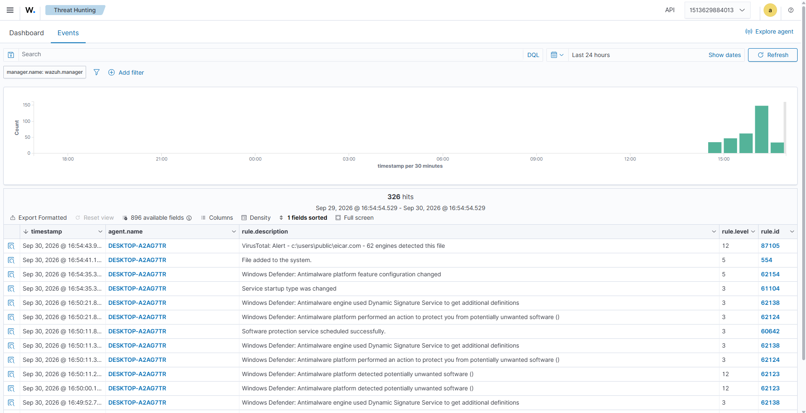
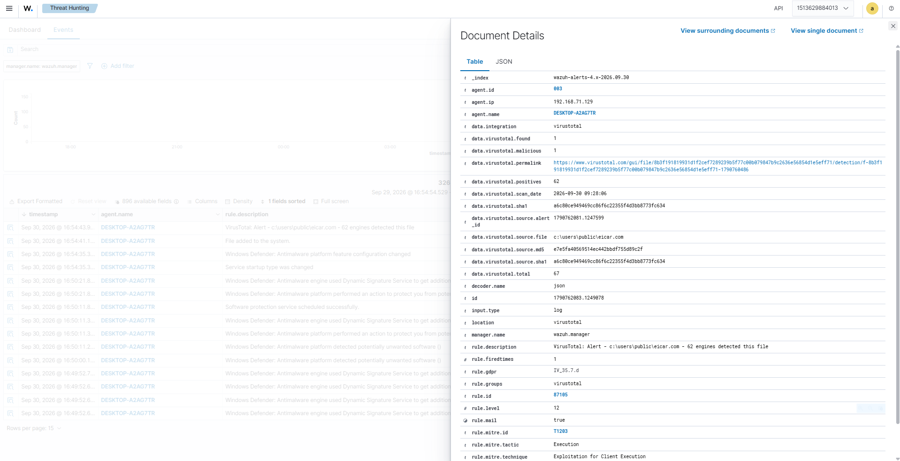

# 🌐 TÍCH HỢP THREAT INTELLIGENCE: VIRUSTOTAL API VÀO WAZUH SIEM

Tài liệu này hướng dẫn chi tiết cách kết nối hệ thống **Wazuh Manager** với cơ sở dữ liệu tình báo mối đe dọa (Threat Intelligence - TI) của **VirusTotal** để tự động tra cứu danh tiếng của các tệp tin lạ, tệp tin tải về hoặc mã độc trên máy Windows Endpoint.

---

## 📌 1. NGUYÊN LÝ HOẠT ĐỘNG (THREAT INTEL PIPELINE)

```
 [Windows Endpoint]
         │
         │ (1) Phát hiện file mới trong thư mục giám sát (FIM / Syscheck)
         ▼
 [Wazuh Agent]
         │
         │ (2) Tính toán hash SHA256/MD5 và gửi Alert về Manager
         ▼
 [Wazuh Manager]
         │
         │ (3) wazuh-integratord bóc tách hash và gọi VirusTotal REST API v3
         ▼
 [VirusTotal Cloud Engine]
         │
         │ (4) Đối soát hash với >70 Antivirus Engines (Kaspersky, Microsoft, CrowdStrike...)
         ▼
 [Wazuh Manager]
         │
         │ (5) Nếu có >= 1 Engine báo độc -> Kích hoạt Rule 87105 (Level 12 - High Severity)
         ▼
 [Wazuh Dashboard]
   Hiển thị chi tiết: Tên file, số lượng engine phát hiện, đường dẫn permalink tới VirusTotal
```

---

## 🔑 2. BƯỚC 1: ĐĂNG KÝ API KEY MIỄN PHÍ CỦA VIRUSTOTAL

1. Truy cập trang web chính thức: [https://www.virustotal.com/gui/join-us](https://www.virustotal.com/gui/join-us)
2. Điền thông tin đăng ký tài khoản miễn phí (Free Community Account).
3. Đăng nhập và nhấp vào ảnh đại diện cá nhân ở góc trên bên phải -> Chọn **API Key**.
4. Sao chép chuỗi mã API Key (dạng chuỗi 64 ký tự hex).
   > *Lưu ý: Tài khoản Free Community cho phép 4 requests/phút và 500 requests/ngày*
5. Chạy file [test_virustotal_lookup.py](test_virustotal_lookup.py) để chạy thử coi đã thành công chưa
---

## ⚙️ 3. BƯỚC 2: CẤU HÌNH TRÊN WAZUH MANAGER

### 3.1. Thêm khối `<integration>` vào `ossec.conf`
Đăng nhập SSH vào máy chủ Ubuntu Wazuh và sửa file cấu hình:

```bash
# Vào container hoặc sửa trực tiếp qua Docker:
sudo docker exec -it single-node-wazuh.manager-1 bash
nano /var/ossec/etc/ossec.conf
```

Tìm đến phần cấu hình `<ossec_config>` và bổ sung khối sau (thay thế `<YOUR_VIRUSTOTAL_API_KEY>` bằng API key thật):

```xml
  <!-- Cấu hình Threat Intelligence Integration với VirusTotal -->
  <integration>
    <name>virustotal</name>
    <api_key>YOUR_VIRUSTOTAL_API_KEY_HERE</api_key>
    <group>syscheck,</group>
    <alert_format>json</alert_format>
  </integration>
```

> 💡 **Giải thích:**
> * `<name>virustotal</name>`: Sử dụng module tích hợp sẵn của Wazuh (nằm tại `/var/ossec/integrations/virustotal`).
> * `<group>syscheck,</group>`: Tự động kích hoạt tra cứu mỗi khi module kiểm tra tính toàn vẹn tệp tin (FIM - Syscheck) phát hiện có file mới hoặc file bị thay đổi trên Endpoint.
> * `<alert_format>json</alert_format>`: Đảm bảo dữ liệu gửi nhận chuẩn JSON.

### 3.2. Khởi động lại dịch vụ Wazuh Manager
```bash
/var/ossec/bin/wazuh-control restart
```
Sau khi khởi động lại, dịch vụ `wazuh-integratord` sẽ tự động chuyển sang trạng thái **`running`** (trước đây là clean exit vì chưa có integration).

---

## 📂 4. BƯỚC 3: CẤU HÌNH FIM (SYSCHECK) TRÊN WINDOWS AGENT

Để Wazuh tính toán hash và gửi về cho VirusTotal kiểm tra, cần chỉ định các thư mục nhạy cảm trên máy Windows Endpoint.

Mở file `C:\Program Files (x86)\ossec-agent\ossec.conf` trên máy Windows 10 (bằng quyền Administrator), tìm thẻ `<syscheck>` và bổ sung:

```xml
  <syscheck>
    <disabled>no</disabled>
    <frequency>300</frequency>
    <scan_on_start>yes</scan_on_start>

    <!-- Giám sát realtime thư mục test (Lưu ý: Có khoảng trắng giữa realtime="yes" và check_all="yes") -->
    <directories realtime="yes" check_all="yes">C:\Users\Public</directories>
    <directories realtime="yes" check_all="yes">C:\xampp\htdocs</directories>
    <directories realtime="yes" check_all="yes">C:\Users\testw\Downloads</directories>
  </syscheck>
```

Khởi động lại dịch vụ Wazuh Agent trên Windows:
```powershell
Restart-Service WazuhSvc
```

---

## 🧪 5. BƯỚC 4: THỰC THI KIỂM CHỨNG & THU THẬP MINH CHỨNG (POC)

### Thử nghiệm 1: Thêm loại trừ Defender & Thả file mã độc mẫu EICAR
> ⚠️ **Lưu ý:** Windows Defender sẽ tự động cách ly (Quarantine) file EICAR trước khi Wazuh kịp tính hash. Do đó cần thêm thư mục test vào danh sách loại trừ (Exclusion) của Defender trước khi tạo file.

Mở PowerShell (Run as Administrator) trên máy Windows 10 và chạy:

```powershell
# 1. Thêm thư mục C:\Users\Public vào danh sách loại trừ của Windows Defender:
Add-MpPreference -ExclusionPath "C:\Users\Public"

# 2. Tạo file mã độc kiểm thử chuẩn quốc tế EICAR:
Set-Content -Path "C:\Users\Public\eicar.com" -Value 'X5O!P%@AP[4\PZX54(P^)7CC)7}$EICAR-STANDARD-ANTIVIRUS-TEST-FILE!$H+H*'
```

### Thử nghiệm 2: Quan sát kết quả trên Wazuh SIEM
1. **Wazuh Agent** phát hiện file `eicar.com` được tạo trong `C:\Users\Public`, tính toán mã băm SHA256: `275a021bbfb6489e54d471899f7db9d1663fc695ec2fe2a2c4538aabf651fd0f` và gửi Alert về Manager.
2. **Wazuh Manager** (`wazuh-integratord`) tự động bắt lấy hash và gửi request tới VirusTotal API.
3. **VirusTotal** trả về kết quả đối soát >65 hãng bảo mật nhận diện độc hại.
4. **Wazuh Dashboard** kích hoạt cảnh báo đặc biệt:
   * **Rule ID 87105 (Level 12):** `Virustotal: Alert - C:\Users\Public\eicar.com - 65 engines detected this file`
   * Bấm vào chi tiết Alert để xem: danh sách các hãng nhận diện (`Kaspersky`, `Microsoft`, `Sophos`), điểm đánh giá độc hại, và link trực tiếp sang VirusTotal.



---

## 📊 6. CÁC QUY TẮC PHÁT HIỆN LIÊN QUAN TRONG WAZUH

Wazuh đã tích hợp sẵn nhóm quy tắc `virustotal` trong file `/var/ossec/ruleset/rules/0490-virustotal_rules.xml`:

| Rule ID | Level | Mô tả | Ý nghĩa thực tế trong SOC |
| :--- | :--- | :--- | :--- |
| **87101** | 0 | `Virustotal: Integration started` | Ghi nhận dịch vụ tích hợp bắt đầu hoạt động. |
| **87104** | 3 | `Virustotal: File not found or clean` | File không có trong database hoặc 0/70 engine nhận diện độc hại. |
| **87105** | **12** | `Virustotal: Alert - Engines detected this file` | **Mã độc xác định!** Cần kích hoạt ngay quy trình cách ly và diệt trừ theo SOP. |
| **87106** | 0 | `Virustotal: Error querying API` | Lỗi API (hết quota hoặc sai API key). |

