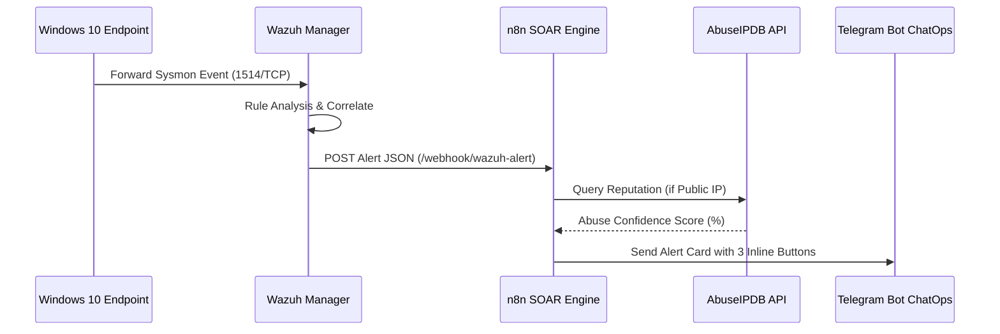

# 📋 QUY TRÌNH ỨNG PHÓ SỰ CỐ TỰ ĐỘNG HÓA QUA SOAR VÀ CHATOPS (SOP-03)
> **Mã quy trình:** SOP-SOC-IR-003  
> **Kỹ thuật MITRE ATT&CK:** [T1110 - Brute Force](https://attack.mitre.org/techniques/T1110/), [T1059.001 - PowerShell](https://attack.mitre.org/techniques/T1059/001/), [T1548.002 - Bypass UAC](https://attack.mitre.org/techniques/T1548/002/), [T1547.001 - Registry Run Keys](https://attack.mitre.org/techniques/T1547/001/)  
> **Cảnh báo liên quan:** Wazuh Rule IDs `100001, 100002, 100004, 100005, 100006, 100007, 87105`  
> **Hệ thống điều phối:** Wazuh SIEM Manager 4.9.2 + n8n SOAR Engine + Telegram ChatOps + Jira Cloud REST API  
> **Đối tượng áp dụng:** SOC Analyst L1/L2, Incident Response Lead, SecOps Automation Engineer  

---

## 🎯 1. TỔNG QUAN & MỤC TIÊU

Quy trình này chuẩn hóa các bước tiếp nhận cảnh báo, làm giàu thông tin tình báo mối đe dọa (Threat Enrichment), và thực thi hành động cách ly tức thời thông qua **mô hình phối hợp Người - Máy (Human-in-the-Loop ChatOps)**.

### Mục tiêu cốt lõi:
1. **Giảm thiểu MTTA & MTTR:** Rút ngắn thời gian nhận biết (MTTA) xuống dưới **5 giây** và thời gian phản ứng cô lập (MTTR) từ 30 phút xuống dưới **30 giây**.
2. **Loại bỏ thao tác thủ công (Toil):** Tự động truy vấn danh tiếng IP trên AbuseIPDB và tổng hợp đầy đủ ngữ cảnh MITRE ATT&CK trước khi báo cáo cho Analyst.
3. **Kiểm soát chặt chẽ quyết định phản ứng:** Mọi hành động cô lập mạng hoặc tạo ticket Jira đều yêu cầu sự phê duyệt trực tiếp của SOC Analyst qua các nút bấm tương tác 2 chiều trên Telegram.

---

## 🔍 2. GIAI ĐOẠN 1: TIẾP NHẬN CẢNH BÁO & LÀM GIÀU THÔNG TIN (ENRICHMENT)

Khi bất kỳ Rule mức độ cao nào (Level 8 – 12) được kích hoạt trên Wazuh Manager:



### Dữ liệu được trích xuất và hiển thị trên Card cảnh báo:
* **Mức độ nghiêm trọng (Severity):** 🚨 CRITICAL (Level 12) / ⚠️ HIGH (Level 8-11).
* **Mã luật & Mô tả:** `[Rule ID]` và tóm tắt kỹ thuật.
* **Kỹ thuật MITRE ATT&CK:** Danh mục Tactic & Technique ID.
* **Nạn nhân (Victim):** Tên máy trạm (`agent.name`) và địa chỉ IP (`agent.ip`).
* **Kẻ tấn công (Attacker):** Địa chỉ IP nguồn và quốc gia xuất xứ.
* **Chỉ số danh tiếng (Threat Intel):** Tỷ lệ báo cáo vi phạm trên AbuseIPDB (`Abuse Confidence Score %`).

---

## 🎮 3. GIAI ĐOẠN 2: ĐIỀU PHỐI TƯƠNG TÁC 2 CHIỀU (HUMAN-IN-THE-LOOP)

Ngay bên dưới thông báo Telegram, hệ thống gắn kèm 3 nút bấm tương tác. Analyst nhấn nút phù hợp dựa trên ma trận quyết định sau:

| Nút bấm tương tác | Điều kiện áp dụng | Hành động tự động được SOAR kích hoạt |
| :--- | :--- | :--- |
| **`[🚫 Khóa IP 24h]`** | Xác nhận là hành vi tấn công ác ý (Brute force, Bypass UAC, C2 Callback). | n8n gửi lệnh tạo Windows Firewall Inbound/Outbound DROP rule trên Endpoint và tường lửa biên trong 24h. |
| **`[⚠️ Bỏ qua / Báo động giả]`** | Kiểm tra thấy là hoạt động diễn tập hoặc quản trị viên thao tác hợp lệ. | n8n ghi nhận log phân loại False Positive vào SOAR Audit Trail, không can thiệp endpoint. |
| **`[📋 Mở Ticket Jira]`** | Cần điều tra chuyên sâu L2/L3 hoặc yêu cầu lập hồ sơ sự cố chính thức. | n8n gọi Jira Cloud REST API v3 tạo Task/Incident trong Project `SEC`, trả về link trực tiếp. |

---

## 🛡️ 4. GIAI ĐOẠN 3: CÁCH LY & TẠO TICKET JIRA CHI TIẾT

### Bước 4.1: Khi Analyst chọn `[🚫 Khóa IP 24h]`
1. Telegram hiển thị thông báo popup: `"Đang thực thi phản ứng: BLOCK..."`.
2. n8n gọi PowerShell Firewall command trên Windows 10 Victim:
   ```powershell
   New-NetFirewallRule -DisplayName "SOAR-AutoBlock-$TargetIP" -Direction Inbound -Action Block -RemoteAddress $TargetIP
   New-NetFirewallRule -DisplayName "SOAR-AutoBlock-Out-$TargetIP" -Direction Outbound -Action Block -RemoteAddress $TargetIP
   ```
3. n8n phản hồi thông báo xác nhận thành công về nhóm Telegram kèm thời gian và tên Analyst phê duyệt.

### Bước 4.2: Khi Analyst chọn `[📋 Mở Ticket Jira]`
1. n8n tạo Payload gửi tới Jira REST API v3:
   - **Project Key:** `SEC`
   - **Summary:** `[Wazuh SOAR Incident] Threat Detected on <IP>`
   - **Priority:** `High`
   - **Components:** `Incident Response`, `Endpoint Security`
2. Jira sinh Issue Key (ví dụ: `SEC-108`).
3. Telegram nhận được thông điệp kèm đường link định dạng:
   ```text
   📋 [JIRA CASE MANAGEMENT - TICKET OPENED]
   🎫 Ticket Key: SEC-108
   🔗 Direct URL: https://soc-lab.atlassian.net/browse/SEC-108
   👤 Reporter: @SOC_Analyst
   📌 Workflow Status: Đã bàn giao sang Queue điều tra của SOC L2.
   ```

---

## 📝 5. GIAI ĐOẠN 4: ĐIỀU TRA L2 & HỒI PHỤC (POST-CONTAINMENT)

1. **Truy cập Jira Ticket:** Analyst L2 nhận bàn giao từ link trên Telegram, cập nhật trạng thái `In Progress`.
2. **Thu thập chứng cứ số:**
   * Tải memory dump hoặc file log Sysmon tại thời điểm phát sinh sự kiện.
   * Gắn các artifacts (SHA256, IP, Process Tree) vào Jira Issue.
3. **Gỡ bỏ cách ly (Unblock):**
   Sau khi xác minh an toàn hoặc hết thời hạn 24 giờ, chạy lệnh gỡ rule tường lửa:
   ```powershell
   Remove-NetFirewallRule -DisplayName "SOAR-AutoBlock-$TargetIP" -ErrorAction SilentlyContinue
   ```
4. **Đóng Ticket (Close Incident):** Cập nhật Root Cause và đóng Ticket trên Jira.
