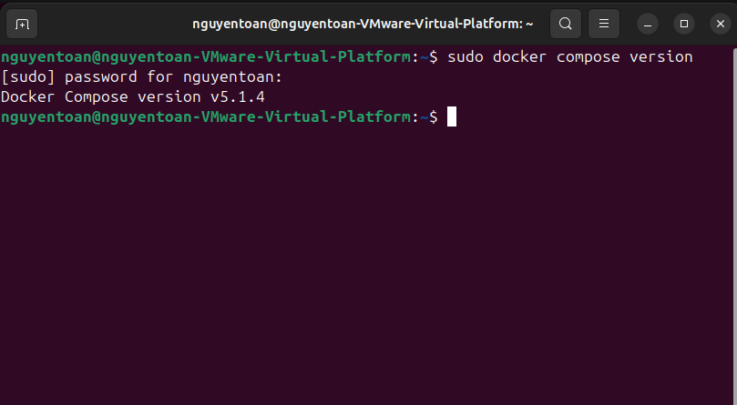
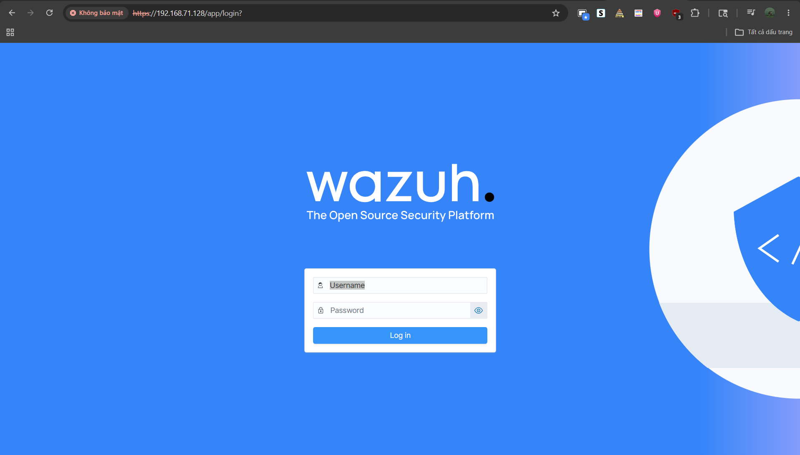
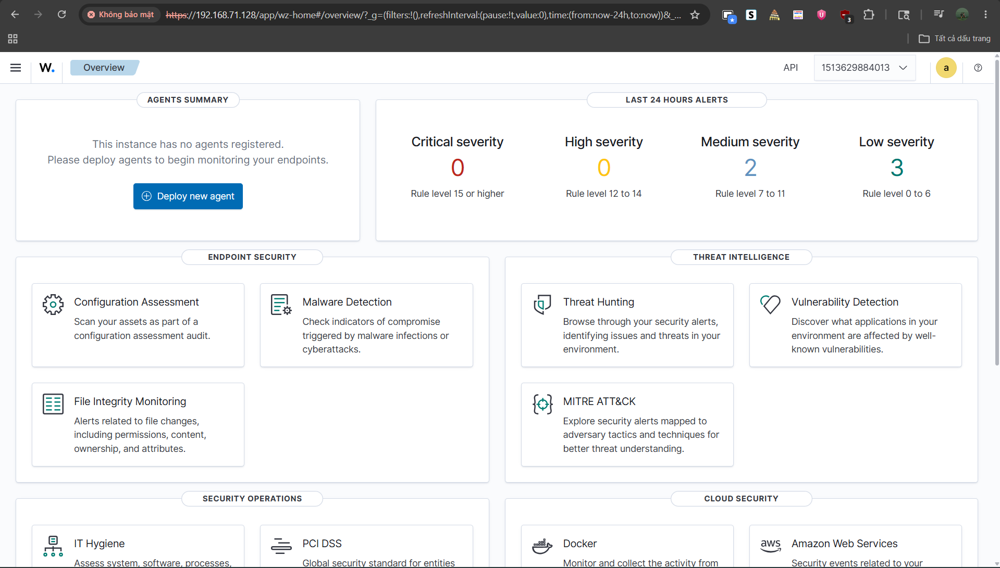

# TRIỂN KHAI HẠ TẦNG WAZUH SIEM (PHASE 1)

* **Dự án:** Nghiên cứu Kỹ thuật Phát hiện và Hệ thống Wazuh SIEM
* **Vị trí giả lập:** SOC Engineer / Detection Engineer
* **Môi trường thực hiện:** Ubuntu Server v24.04 / v22.04 LTS (Chạy trên VMware Workstation)
* **Mục tiêu Phase 1:** Triển khai thành công cụm trung tâm Wazuh Stack (Indexer, Manager, Dashboard) bằng Docker Compose, tối ưu hóa tài nguyên phần cứng, mở rộng không gian lưu trữ đĩa và cấu hình thay đổi mật khẩu quản trị bảo mật hệ thống.

---

## I. CHUẨN BỊ TÀI NGUYÊN & CẤU HÌNH NHÂN (KERNEL HARDENING)

Wazuh Indexer sử dụng lõi lưu trữ phân tích dữ liệu lớn dựa trên nền tảng OpenSearch (Java). Hệ thống yêu cầu cấu hình bộ nhớ ảo của nhân Linux cao hơn mức mặc định để tránh hiện tượng nghẽn hoặc sập tiến trình (crash) khi khởi động.

### 1. Phân bổ tài nguyên máy ảo ban đầu (Ubuntu Server)
* **vCPU:** 2 Cores (tối thiểu).
* **RAM:** 4GB RAM (Mức tối thiểu vận hành cho môi trường Lab đơn Agent).
* **Storage:** Cấu hình mở rộng đạt **65GB SSD** (Nới rộng phân vùng hệ thống để đảm bảo không gian lưu trữ log và tệp tin đệm).

### 2. Cấu hình mở rộng không gian ổ đĩa hệ thống (Disk Partition Resizing)
Sau khi thực hiện mở rộng dung lượng phần cứng trên VMware từ 40GB lên 65GB, tiến hành đồng bộ phân vùng logic của hệ điều hành Ubuntu để nhận trọn vẹn 25GB không gian trống cấp thêm bằng công cụ dòng lệnh:

```bash
# 1. Yêu cầu nhân Linux quét lại kích thước phân vùng sda2
sudo resizepart /dev/sda 2

# 2. Ép hệ thống tệp tin (File System) nới rộng không gian lưu trữ thực tế
sudo resize2fs /dev/sda2
```
Kiểm tra lại không gian lưu trữ bằng lệnh `df -h /`, hệ thống xác nhận dung lượng phân vùng đạt mức **~63GB** với không gian trống khả dụng lớn (Sẵn sàng chống nghẽn đĩa).

### 3. Cấu hình giới hạn bộ nhớ ảo (Virtual Memory Tuning)

Tiến hành tăng thông số bộ nhớ ảo `vm.max_map_count` tạm thời và cấu hình ghi đè vĩnh viễn vào tệp cấu hình hệ thống để duy trì trạng thái ổn định sau khi tái khởi động máy ảo:

```bash
# Thiết lập cấu hình tạm thời trong thời gian thực
sudo sysctl -w vm.max_map_count=262144

# Ghi cấu hình vĩnh viễn vào tệp cấu hình hệ thống
echo "vm.max_map_count=262144" | sudo tee -a /etc/sysctl.conf
```


---

## II. ĐỒNG BỘ MÔI TRƯỜNG DOCKER & DOCKER COMPOSE

Để đảm bảo tính đóng gói, dễ quản lý cấu hình và không gây xung đột thư viện với hệ điều hành gốc, toàn bộ hạ tầng Wazuh được triển khai thông qua công nghệ Container hóa (Docker Engine).

### 1. Chuỗi lệnh cài đặt Docker Engine chính thức

Cập nhật danh sách gói tin, thiết lập kho lưu trữ bảo mật (Repository GPG Key) và cài đặt Docker cùng công cụ Docker Compose Plugin:

```bash
# 1. Cập nhật hệ thống và cài đặt gói phụ thuộc
sudo apt update && sudo apt install -y apt-transport-https ca-certificates curl gnupg lsb-release

# 2. Thiết lập Docker GPG Key an toàn
sudo mkdir -p /etc/apt/keyrings
curl -fsSL [https://download.docker.com/linux/ubuntu/gpg](https://download.docker.com/linux/ubuntu/gpg) | sudo gpg --dearmor -o /etc/apt/keyrings/docker.gpg

# 3. Khai báo Docker Repository chuẩn theo phiên bản OS
echo "deb [arch=$(dpkg --print-architecture) signed-by=/etc/apt/keyrings/docker.gpg] [https://download.docker.com/linux/ubuntu](https://download.docker.com/linux/ubuntu) $(lsb_release -cs) stable" | sudo tee /etc/apt/sources.list.d/docker.list > /dev/null

# 4. Cài đặt Docker phân hệ chính thức
sudo apt update && sudo apt install -y docker-ce docker-ce-cli containerd.io docker-compose-plugin

# 5. Kích hoạt và thiết lập Docker khởi động cùng hệ thống
sudo systemctl enable docker && sudo systemctl start docker
```

Kiểm tra trạng thái hoạt động của Docker Compose trên máy ảo bằng lệnh: `sudo docker compose version`.



---

## III. TRIỂN KHAI CỤM TRUNG TÂM WAZUH STACK (SINGLE-NODE ARCHITECTURE)

Sử dụng cấu hình kiến trúc Single-node (phù hợp cho môi trường nghiên cứu và Lab doanh nghiệp vừa/nhỏ) nhằm gom toàn bộ các thành phần quản lý về một thực thể xử lý.

### 1. Đồng bộ mã nguồn cấu hình từ nhà phát hành

Tải cấu hình Docker định hình sẵn từ kho lưu trữ của Wazuh:

```bash
cd ~
git clone [https://github.com/wazuh/wazuh-docker.git](https://github.com/wazuh/wazuh-docker.git) --depth=1 -b v4.14.5
cd wazuh-docker/single-node
```
### 2. Thiết lập quy trình giới hạn tệp tin Log hệ thống

Để ngăn chặn hiện tượng các container sinh ra vòng lặp log lỗi ghi đè làm cạn kiệt ổ đĩa vô lý khi hệ thống bị ngắt đột ngột, tiến hành bổ sung tham số giới hạn (`logging`) vào tệp tin `docker-compose.yml`:

```yaml
logging:
  driver: "json-file"
  options:
    max-size: "10m"
    max-file: "3"
```

---

## IV. CẤU HÌNH THAY ĐỔI MẬT KHẨU TÀI KHOẢN QUẢN TRỊ (ADMIN SECURITY HARDENING)

Để đảm bảo an toàn thông tin tối cao cho trung tâm giám sát SOC, mật khẩu mặc định `SecretPassword` cần được thay thế bằng một cơ chế mật khẩu mạnh thông qua chuỗi băm (Hash Key).

### Bước 1: Hạ hệ thống và tạo chuỗi mã hóa mật khẩu mới

Tiến hành gọi container trung gian để chạy script mật mã OpenSearch nhằm tạo chuỗi băm bảo mật:

```bash
sudo docker compose down

sudo docker run --rm -ti wazuh/wazuh-indexer:4.14.5 bash /usr/share/wazuh-indexer/plugins/opensearch-security/tools/hash.sh
```
*Nhập mật khẩu mới tại dấu nhắc hệ thống để nhận về chuỗi mã hóa đầu ra dạng:* `$2y$12$...`

### Bước 2: Cập nhật tệp cấu hình nội bộ

1. Cấu hình chuỗi băm mới vào file quản lý người dùng nội bộ:
```bash
nano config/wazuh_indexer/internal_users.yml
```
*Dán chuỗi mã hóa thu được ở Bước 1 vào mục `hash` của tài khoản `admin`.*
2. Cấu hình mật khẩu thô mới vào tệp `docker-compose.yml` tại các tham số môi trường `INDEXER_PASSWORD` của hai dịch vụ `wazuh.manager` và `wazuh.dashboard`.

### Bước 3: Áp dụng thay đổi vào lòng Container Indexer

Khởi chạy lại cụm dịch vụ và chui vào bên trong container điều hành để ép nạp cấu hình bảo mật:

```bash
# Khởi chạy cụm dịch vụ ở chế độ chạy ngầm (Detached Mode)
sudo docker compose up -d

# Truy cập vào không gian thực thi của container Indexer
sudo docker exec -it single-node-wazuh.indexer-1 bash
```

Khi Terminal chuyển sang giao diện `bash-5.2$`, thực thi chuỗi lệnh nạp quyền tối cao:

```bash
export INSTALLATION_DIR=/usr/share/wazuh-indexer
export CONFIG_DIR=$INSTALLATION_DIR/config
CACERT=$CONFIG_DIR/certs/root-ca.pem
KEY=$CONFIG_DIR/certs/admin-key.pem
CERT=$CONFIG_DIR/certs/admin.pem
export JAVA_HOME=/usr/share/wazuh-indexer/jdk

bash /usr/share/wazuh-indexer/plugins/opensearch-security/tools/securityadmin.sh -cd $CONFIG_DIR/opensearch-security/ -nhnv -cacert $CACERT -cert $CERT -key $KEY -p 9200 -icl
```

Hệ thống hiển thị thông báo: **`Done with success`** (Xác nhận cấu hình mật khẩu mới chính thức có hiệu lực trên toàn cụm SIEM). Gõ `exit` để thoát khỏi container.

---

## V. KIỂM TRA ĐỘ ỔN ĐỊNH & KIỂM CHỨNG TRUY CẬP (VALIDATION)

Chạy lệnh kiểm tra trạng thái sức khỏe toàn hệ thống:

```bash
sudo docker ps
```

Yêu cầu cả 3 thực thể `wazuh.indexer`, `wazuh.manager`, và `wazuh.dashboard` đều duy trì trạng thái ổn định lâu dài (`Up` / `healthy`).

### Kết quả xác thực quyền điều hành Giao diện Web Trung tâm

* **Địa chỉ kết nối an toàn:** `https://192.168.71.128` (Thông qua IP tĩnh/động của Card mạng chính `ens33` kết nối mạng Host-Only/NAT của VMware).
* **Thông tin xác thực mới:**
* *Username:* `admin`
* *Password:* `<MẬT_KHẨU_MỚI_ĐÃ_THIẾT_LẬP>`





---

## VI. QUY TRÌNH VẬN HÀNH VÀ BẢO TRÌ HỆ THỐNG AN TOÀN

Để đảm bảo toàn vẹn dữ liệu cơ sở dữ liệu lớn của Indexer và không phát sinh file rác hệ thống, quy trình đóng/mở máy ảo được chuẩn hóa như sau:

* **Trước khi tắt máy ảo/VMware:** Phải chủ động hạ dịch vụ êm ái để lưu tiến trình Java:
```bash
sudo docker compose stop
```


*(Tuyệt đối không sử dụng lệnh `down -v` trừ khi muốn xóa sạch toàn bộ Lab để làm lại từ đầu).*
* **Sau khi bật lại máy ảo:** Kích hoạt lại dịch vụ chạy ngầm giải phóng Terminal:
```bash
sudo docker compose up -d
```


---

## VII. ĐỊNH HƯỚNG BƯỚC TIẾP THEO (PHASE 2)

Hạ tầng cụm trung tâm SIEM (Wazuh Stack) đã hoạt động hoàn hảo và sẵn sàng thu nhận thông tin.

**Kế hoạch triển khai Phase 2:**

1. Khởi chạy máy trạm **Windows 10 (Victim)**, thực hiện tải và kết nối **Wazuh Agent** đẩy luồng thông tin về địa chỉ máy chủ `192.168.71.128`.
2. Tích hợp sâu bộ công cụ kiểm toán **Microsoft Sysmon** trên máy mục tiêu, tùy biến cấu hình tệp `ossec.conf` để phân tích sâu các mã sự kiện đặc thù (Event IDs), chuẩn bị cho việc mô phỏng và phát hiện tấn công thực chiến.

## REFERENCES
- [Cài đặt wazuh docker container](https://documentation.wazuh.com/current/deployment-options/docker/wazuh-container.html)