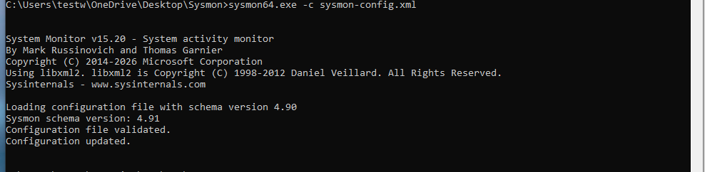

# Deploy Wazuh Agent Configuration on Endpoint (Phase 2)

* **Project:** Research Detection Techniques and Wazuh SIEM System
* **Simulated Role:** SOC Engineer / Detection Engineer
* **Execution Environment:** Windows 10 Pro (Victim VM running on VMware)
* **Phase 2 Objective:** Package, install, and activate the log collection system (Wazuh Agent) on the target endpoint; establish a secure authentication mechanism (Authentication Key) to set up a real-time encrypted communication channel to the central server.

---

## I. Installation and Authentication Registration Workflow (Agent Enrollment)

The nature of Wazuh Agent on Windows operates as a background system service (`WazuhSvc`). To ensure information security, Agent cannot connect freely and must perform a registration procedure to receive an encrypted "Passport" from Wazuh Manager.

### 1. Deploy Software Package Installation

* **Synchronized version:** `wazuh-agent-4.14.5-1.msi` (Ensure version matches central cluster to avoid log routing library conflicts).
* **System requirements:** Execute with highest administrative privileges (`Administrator`) to have permission to intervene in Windows Services management subsystem.

### 2. Configuration Command Chain and Force Load Authentication Key (CLI Hardening)

When installing via interface or basic command line, the system will report `Agent: Auth key not imported` error and maintain `Not Running` status. Proceed to resolve completely by opening **Command Prompt (CMD)** with **Run as Administrator** and executing the following command chain:

```cmd
:: 1. Navigate to Agent's root distribution directory
cd "C:\Program Files (x86)\ossec-agent"

:: 2. Declare Manager server IP to activate automatic key request process
agent-auth.exe -m 192.168.71.128

:: 3. Restart system service to apply new configuration
NET STOP WazuhSvc
NET START WazuhSvc
```

### 3. Validate Local Operational Status on Endpoint

Command Prompt screen displays `Valid key received. Merging key and restarting...` message and service reports `started successfully`. When calling internal management interface via `win32ui.exe` (or `wazuh-agentui.exe`) file, system confirms:

* **Manager IP:** Correctly records `192.168.71.128` address.
* **Authentication Key:** Automatically fills secure hash key string issued by server.
* **Status:** Switches to **`Running`** status.


---

## II. Check Stability and Data Flow on SOC Dashboard

After Agent on Victim machine activates `Running` status, network security data flow is immediately packaged, encrypted, and pushed to Wazuh Manager's central service port.

### 1. Validate Overall Connection (Agents Summary)

Access central Web Dashboard interface at `https://192.168.71.128` address, system displays status chart of entire monitoring infrastructure:

* **Active section:** Metric jumps from `0` to **`1`** (Confirm 1 Agent successfully connected directly).
* **Disconnected section:** Displays `0` (No devices stuck connecting or losing signal).

### 2. Receive Initial System Log Signals

Although real attack scenarios have not been deployed, the **Last 24 Hours Alerts** subsystem has started recording standard security events pushed from Windows 10 endpoint (including system audit logs, local process status changes) belonging to medium and low alert severity classes (`Medium severity` and `Low severity`). This proves the SOC communication channel is 100%通畅.


---
## III. Install and Configure Microsoft Sysmon v15.2

### 1. Overview of Sysmon Capabilities

System Monitor (Sysmon) is a Windows system service and driver. After installation, Sysmon will run hidden continuously even when restarting the machine to monitor and record in-depth behaviors into Windows Event Log.

When combining Sysmon events with SIEM systems (like Wazuh), SOC analysis experts can easily detect abnormal behaviors and how malware operates. This service runs as a protected process (Protected Process), preventing most unauthorized intervention behaviors from users.

---

### 2. Detailed Installation Guide (Windows Victim Machine)

To deploy Sysmon on target Windows VM, you follow the standard command-line steps below. **Note:** The installation process completely does not require restarting the VM.

- Step 1: Launch Administrator Privilege Environment

Press `Start` button → Type `cmd` → Right-click **Command Prompt** → Select **Run as administrator**.

- Step 2: Navigate to Directory Containing Sysmon Installer

Use `cd` command to navigate to the directory where you extracted the downloaded file (Example: Downloads folder):

```cmd
cd "C:\Users\testw\Downloads\Sysmon"
```

(Note that standard installer for 64-bit architecture will use executable file named `sysmon64.exe` or `sysmon.exe`).

- Step 3: Execute System Installation Command
* **Install with accompanying XML Configuration File:**
Apply pre-loaded filters from configuration file (example `sysmon-config.xml` file) to filter out noisy processes and enable in-depth monitoring
```cmd
sysmon64.exe -c sysmon-config.xml
```

* You can refer to your sysmon-config.xml file as follows:
```
&lt;Sysmon schemaversion="4.90"&gt;
  &lt;HashAlgorithms&gt;MD5,SHA256&lt;/HashAlgorithms&gt;
  &lt;EventFiltering&gt;
    &lt;ProcessCreate onmatch="exclude"&gt;
    &lt;/ProcessCreate&gt;

    &lt;NetworkConnect onmatch="include"&gt;
      &lt;Image condition="contains"&gt;cmd.exe&lt;/Image&gt;
      &lt;Image condition="contains"&gt;powershell.exe&lt;/Image&gt;
    &lt;/NetworkConnect&gt;

    &lt;FileCreate onmatch="include"&gt;
      &lt;TargetFilename condition="contains"&gt;\.exe&lt;/TargetFilename&gt;
      &lt;TargetFilename condition="contains"&gt;\.ps1&lt;/TargetFilename&gt;
      &lt;TargetFilename condition="contains"&gt;\.bat&lt;/TargetFilename&gt;
    &lt;/FileCreate&gt;
  &lt;/EventFiltering&gt;
&lt;/Sysmon&gt;
```
---

### 3. Quick Reference Table of Sysmon Administration Commands

After successful installation, you can manage Sysmon service directly with the following command syntax:

| Command-line Syntax | Technical Execution Purpose |
| ------------------- | ---------------------------- |
| `sysmon64 -c`       | Dump (Export) entire current Sysmon configuration to screen. |
| `sysmon64 -c <path_to_config.xml>` | Update/Overwrite a new event filter configuration file into running driver. |
| `sysmon64 -c --`    | Remove custom configuration file, return Sysmon to default configuration status. |
| `sysmon64 -s`       | Print entire data structure schema format (Configuration Schema) of events. |
| `sysmon64 -u`       | Completely uninstall (Remove) Sysmon service and driver from Windows. |

---

### 4. Guide to Check Logs on Windows Event Viewer

After successful installation, all logs audited by Sysmon will be stored in standard UTC time format at the following fixed path on Windows operating system (from Windows Vista onwards):

📂 **`Applications and Services Logs / Microsoft / Windows / Sysmon / Operational`**

---

### 5. Summary of Remaining Live Event IDs (Event IDs) in Attack Lab

To configure Wazuh's `ossec.conf` file to accurately capture data flow, you need to pay special attention to the following core Event IDs:

* **Event ID 1 (Process creation):** Record detailed information of every created process, including **full command line executed** of both current process and parent process. Extremely useful for capturing hacker behavior running shell commands.


* **Event ID 2 (A process changed a file creation time):** Detect file "timestamp manipulation" technique (Timestomping). This technique is often used by malware to modify backdoor file creation date to match OS installation date to evade administrators.


* **Event ID 3 (Network connection):** Record all TCP/UDP connections on the machine. Clearly shows source/destination IP, source/destination port, and which process name is performing network connection (Disabled by default, must enable via configuration file).


* **Event ID 8 (CreateRemoteThread):** Detect code injection technique when a process arbitrarily creates an execution thread (thread) hidden inside another legitimate process.


* **Event ID 9 (RawAccessRead):** Detect behavior of directly reading disk with delimiter character `\\.\`. This technique helps malware bypass (evade) regular file audit tools to steal locked system files.


* **Event ID 11 (FileCreate):** Record every behavior of creating new or overwriting files. Very important for monitoring sensitive partitions like Startup folder, Temp folder or Downloads folder.


* **Event ID 12, 13, 14 (RegistryEvent):** Monitor behaviors of creating, deleting, renaming or changing values in Registry. Help detect malware creating persistence mechanism in autostart regions.


* **Event ID 22 (DNSEvent):** Record all DNS domain name queries of every application (successful or failed), help detect connection traffic to hacker's C2 control server.


### 6. Data Flow Workflow and Launch Simulated Events

To validate Sysmon's deep log capture capability coordinated with SIEM system, we need to perform infrastructure preparation steps to completely remove all default log filter barriers of the system.

#### a. Prerequisite Preparation Steps
1. **Activate all service containers on Ubuntu server:**
```bash
sudo docker compose up -d
```

2. **Reactivate Wazuh Agent service on Windows Victim machine:**
Open CMD with Admin privileges and execute:
```cmd
NET START WazuhSvc
```
3. **Lower alert blocking threshold on Wazuh Manager (Ubuntu):** By default, Wazuh Manager only pushes logs with `Rule Level >= 3` to Web interface. Because normal command typing behavior or Sysmon network setup is sometimes classified in the safe audit group (low Level from 0 to 2), we need to intervene in `/var/ossec/etc/ossec.conf` file inside `single-node-wazuh.manager-1` container, modify `<log_alert_level>` tag configuration from `3` to number **`0`**. This operation forces the system to record all real logs to Dashboard, avoiding logs being hidden silently under raw `alerts.json` file.
4. **Disable Border Firewall (Firewall Bypass):** Completely turn off Windows Defender Firewall on Victim machine to ensure network connection port `1514/TCP` (encrypted log push flow from Agent to Manager) is通畅, not silently blocked by Windows local security policy.

#### b. Proceed to Create Simulated Events on Windows 10 Victim Machine

After confirming endpoint status displays `Active` on Dashboard, we proceed to create an execution behavior (Execution) with large coverage to force Sysmon to generate both Event ID 1 (Process Creation) and Event ID 3 (Network Connection):

1. On Windows 10 Victim machine, open normal **Command Prompt (CMD)** or **PowerShell** window.
2. Execute command calling nested shell and establish HTTP/HTTPS web session to external Internet:
```cmd
powershell -Command "Invoke-WebRequest -Uri [https://google.com](https://google.com)"
```
- Check results on Web Dashboard
  - Now, you open browser on real machine, access **Wazuh Dashboard** management interface (`[https://192.168.71.128](https://192.168.71.128)`) to hunt for the newly generated logs:
1. On left navigation menu bar (three horizontal lines icon) → Select **Threat Intelligence (then select Threat Hunting)** → Then select **Events** tab (located right next to Dashboard tab).
2. We view Document Details will see:
```
data.win.eventdata.commandLine
"C:\WINDOWS\System32\WindowsPowerShell\v1.0\powershell.exe" -Command "Invoke-WebRequest -Uri https://google.com"
```

---


## IV. Next Steps Direction (Phase 3): Simulate Real-World Attacks and Build Custom Detection Rules (Detection Engineering)

After completing Phase 2 – successfully打通 log pipeline (Log Ingestion Pipeline) from **Sysmon → Wazuh Agent → Wazuh Manager → Indexer/Dashboard** and lowering safety filter threshold to Level 0, the entire SOC Lab infrastructure is ready for the next core phase.

Research and technique execution direction in **Phase 3** will focus on the following core target axes:

### 1. Implement Real-World Attack Scenarios (Attack Simulation)

Instead of using harmless simulated commands purely for checking network data flow, Phase 3 will deploy in-depth attack techniques simulated according to **MITRE ATT&amp;CK Framework** matrix, directly impacting Windows 10 Victim machine's operating system:

* **Credential Access (Recommend using Mimikatz):** Simulate behavior of dumping `lsass.exe` process memory to steal credentials (Credential Dumping), trigger extremely severe alerts related to Sysmon Event ID 10 (ProcessAccess) and Event ID 1.
* **Persistence (Create persistence mechanism):** Simulate malware behavior when intentionally implanting into system by creating malicious background tasks via `Schtasks`, or modifying autostart Registry keys (`Run/RunOnce`), force Sysmon to trigger Event ID 12, 13 (RegistryEvent) chain.
* **Defense Evasion (Evasion behavior):** Test hacker bypass techniques like turning off security services via `net stop` command or using legitimate Windows processes to execute malware (LOLBins).

### 2. Develop Custom Analysis Rules (Custom Rules &amp; Decoders)

Although Wazuh system has a very large default rule repository, for sophisticated attack techniques (like using EICAR malware string stored as secret text file or advanced PowerShell bait commands), basic rules may miss or only evaluate at low Level:

* **Intervene in `local_rules.xml` file:** Proceed to access inside Wazuh Manager's configuration directory structure on Ubuntu server to write additional custom logic rule blocks.
* **Optimize alert level (Rule Level Tuning):** Set up intelligent filter conditions based on "valuable" data fields received from Sysmon like `data.win.eventdata.image`, `data.win.eventdata.commandLine`, or `data.win.eventdata.parentImage`. Force system to raise alert level to **Level 10 - 15 (High/Critical Severity)** immediately upon detecting characteristic malicious character strings.

### 3. Standardize Operational Workflow and Security Monitoring (SOC Operational Framework)

* **Build dedicated intuitive Dashboard (Custom Visualization):** Set up pinned fixed filters (Pinned Filters), Aggregations on Threat Hunting subsystem to create a separate monitoring chart for malicious Sysmon log flow.
* **Research Active Response mechanism:** Investigate configuration in Manager's `ossec.conf` file to automatically trigger pre-wrapped scripts (like running IP isolation command, silently terminate malicious process on Windows Victim machine) immediately upon SOC system detecting dangerous level alerts, completing closed-loop cycle model: **Detect → Analyze → Alert → Auto-block**.

## References
- [Install sysmon](https://learn.microsoft.com/en-us/sysinternals/downloads/sysmon)
- [Install Wazuh agent](https://documentation.wazuh.com/current/installation-guide/wazuh-agent/index.html)
