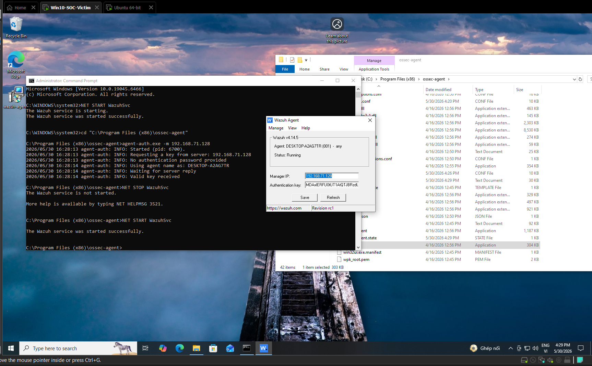
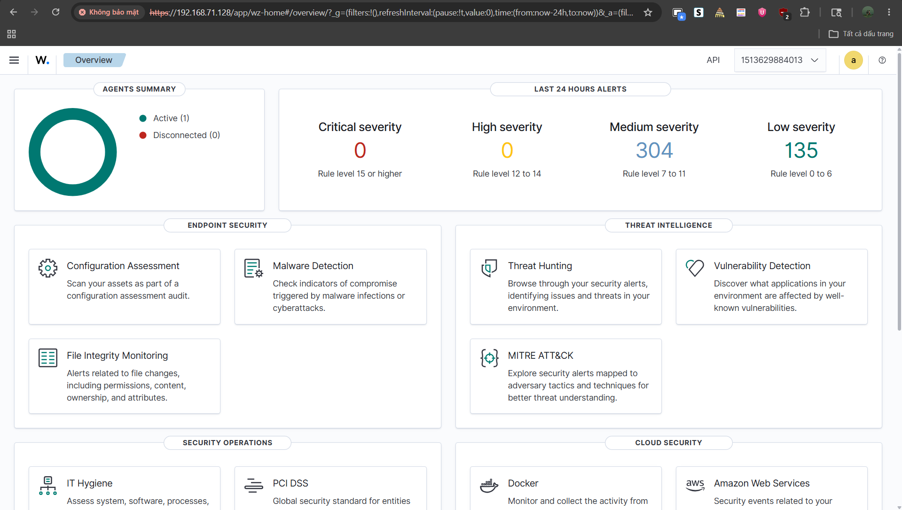

# TRIỂN KHAI CẤU HÌNH WAZUH AGENT TRÊN ENDPOINT (PHASE 2)

* **Dự án:** Nghiên cứu Kỹ thuật Phát hiện và Hệ thống Wazuh SIEM
* **Vị trí giả lập:** SOC Engineer / Detection Engineer
* **Môi trường thực hiện:** Windows 10 Pro (Máy ảo Victim chạy trên VMware)
* **Mục tiêu Phase 2:** Thực hiện đóng gói, cài đặt và kích hoạt hệ thống thu thập log (Wazuh Agent) trên máy trạm mục tiêu; thiết lập cơ chế xác thực an toàn (Authentication Key) để thiết lập kênh giao tiếp mã hóa thời gian thực về máy chủ trung tâm.

---

## I. QUY TRÌNH CÀI ĐẶT VÀ KHỞI TẠO ĐĂNG KÝ XÁC THỰC (AGENT ENROLLMENT)

Bản chất của Wazuh Agent trên Windows hoạt động như một dịch vụ hệ thống chạy ngầm (`WazuhSvc`). Để đảm bảo an toàn thông tin, Agent không thể kết nối tự do mà bắt buộc phải thực hiện thủ tục đăng ký để nhận "Thẻ thông hành" mã hóa từ Wazuh Manager.

### 1. Triển khai cài đặt gói phần mềm

* **Phiên bản đồng bộ:** `wazuh-agent-4.14.5-1.msi` (Đảm bảo khớp phiên bản với cụm trung tâm để tránh xung đột thư viện điều hướng log).
* **Yêu cầu hệ thống:** Thực thi dưới quyền quản trị tối cao (`Administrator`) để có quyền can thiệp vào phân hệ quản lý dịch vụ Windows Services.

### 2. Chuỗi lệnh cấu hình và ép nạp khóa xác thực (CLI Hardening)

Khi cài đặt bằng giao diện hoặc dòng lệnh cơ bản, hệ thống sẽ báo lỗi `Agent: Auth key not imported` và duy trì trạng thái `Not Running`. Tiến hành xử lý dứt điểm bằng cách mở **Command Prompt (CMD)** với quyền **Run as Administrator** và thực thi chuỗi lệnh sau:

```cmd
:: 1. Di chuyển vào thư mục phân phối gốc của Agent
cd "C:\Program Files (x86)\ossec-agent"

:: 2. Khai báo IP máy chủ Manager để kích hoạt tiến trình xin cấp khóa tự động
agent-auth.exe -m 192.168.71.128

:: 3. Tái khởi động dịch vụ hệ thống để áp dụng cấu hình mới
NET STOP WazuhSvc
NET START WazuhSvc
```

### 3. Kiểm chứng trạng thái hoạt động cục bộ trên Endpoint

Màn hình Command Prompt xuất hiện thông báo `Valid key received. Merging key and restarting...` và dịch vụ báo `started successfully`. Khi gọi giao diện quản trị nội bộ bằng tệp `win32ui.exe` (hoặc `wazuh-agentui.exe`), hệ thống xác nhận:

* **Manager IP:** Ghi nhận chính xác địa chỉ `192.168.71.128`.
* **Authentication Key:** Tự động điền chuỗi khóa băm bảo mật được cấp phát từ máy chủ.
* **Status:** Chuyển sang trạng thái **`Running`**.



---

## II. KIỂM TRA ĐỘ ỔN ĐỊNH VÀ THÔNG LUỒNG DỮ LIỆU TRÊN SOC DASHBOARD

Sau khi Agent trên máy Victim kích hoạt trạng thái `Running`, luồng dữ liệu an ninh mạng ngay lập tức được đóng gói, mã hóa và đẩy về cổng dịch vụ trung tâm của Wazuh Manager.

### 1. Xác thực kết nối tổng quan (Agents Summary)

Truy cập giao diện Web Dashboard trung tâm tại địa chỉ `https://192.168.71.128`, hệ thống hiển thị biểu đồ trạng thái của toàn bộ hạ tầng giám sát:

* **Mục Active:** Chỉ số nhảy từ `0` lên **`1`** (Xác nhận có 1 Agent kết nối trực tiếp thành công).
* **Mục Disconnected:** Hiển thị `0` (Không có thiết bị kẹt kết nối hoặc mất tín hiệu).

### 2. Thu nhận tín hiệu Log hệ thống ban đầu

Mặc dù chưa triển khai các kịch bản tấn công thực chiến, phân hệ **Last 24 Hours Alerts** đã bắt đầu ghi nhận các sự kiện an ninh tiêu chuẩn được đẩy về từ máy trạm Windows 10 (bao gồm log kiểm toán hệ thống, sự thay đổi trạng thái tiến trình cục bộ) thuộc các phân lớp cảnh báo trung bình và thấp (`Medium severity` và `Low severity`). Điều này minh chứng kênh truyền thông SOC đã thông suốt 100%.



---
## III. CÀI ĐẶT VÀ CẤU HÌNH MICROSOFT SYSMON v15.2

### 1. TỔNG QUAN VỀ KHẢ NĂNG CỦA SYSMON

System Monitor (Sysmon) là một dịch vụ hệ thống và trình điều khiển (driver) của Windows. Sau khi cài đặt, Sysmon sẽ chạy ẩn liên tục ngay cả khi khởi động lại máy để giám sát và ghi lại các hành vi chuyên sâu vào Windows Event Log.

Khi kết hợp các sự kiện của Sysmon với các hệ thống SIEM (như Wazuh), chuyên gia phân tích SOC có thể dễ dàng phát hiện các hành vi bất thường và cách thức hoạt động của mã độc. Dịch vụ này chạy dưới dạng một tiến trình được bảo vệ (Protected Process), ngăn chặn hầu hết các hành vi can thiệp trái phép từ phía người dùng.

---

### 2. HƯỚNG DẪN CÀI ĐẶT CHI TIẾT (MÁY WINDOWS VICTIM)

Để triển khai Sysmon trên máy ảo Windows mục tiêu, bạn thực hiện theo các bước dòng lệnh chuẩn sau đây. **Lưu ý:** Tiến trình cài đặt hoàn toàn không yêu cầu khởi động lại máy ảo.

- Bước 1: Khởi chạy môi trường Quyền Quản trị

Bấm nút `Start` $\rightarrow$ Gõ `cmd` $\rightarrow$ Nhấp chuột phải vào **Command Prompt** $\rightarrow$ Chọn **Run as administrator**.

- Bước 2: Di chuyển đến thư mục chứa bộ cài Sysmon

Sử dụng lệnh `cd` để di chuyển vào thư mục mà bạn đã giải nén tệp tải về (Ví dụ: thư mục Downloads):

```cmd
cd "C:\Users\testw\Downloads\Sysmon"
```

(Tài liệu lưu ý bộ cài chuẩn cho cấu trúc 64-bit sẽ sử dụng tệp tin thực thi mang tên `sysmon64.exe` hoặc `sysmon.exe`).

- Bước 3: Thực thi lệnh cài đặt hệ thống
* **Cài đặt đi kèm File cấu hình XML:**
Áp dụng các bộ lọc nạp sẵn từ tệp cấu hình (ví dụ file `sysmon-config.xml`) để lọc bỏ các tiến trình nhiễu và bật giám sát chuyên sâu
```cmd
sysmon64.exe -c sysmon-config.xml
```

* Bạn có thể tham khảo file sysmon-config.xml của mình như sau:
```
<Sysmon schemaversion="4.90">
  <HashAlgorithms>MD5,SHA256</HashAlgorithms>
  <EventFiltering>
    <ProcessCreate onmatch="exclude">
    </ProcessCreate>

    <NetworkConnect onmatch="include">
      <Image condition="contains">cmd.exe</Image>
      <Image condition="contains">powershell.exe</Image>
    </NetworkConnect>

    <FileCreate onmatch="include">
      <TargetFilename condition="contains">\.exe</TargetFilename>
      <TargetFilename condition="contains">\.ps1</TargetFilename>
      <TargetFilename condition="contains">\.bat</TargetFilename>
    </FileCreate>
  </EventFiltering>
</Sysmon>
```
---

### 3. BẢNG TRA CỨU NHANH CÁC LỆNH QUẢN TRỊ SYSMON

Sau khi cài đặt thành công, bạn có thể quản trị dịch vụ Sysmon trực tiếp bằng các cú pháp lệnh sau:

| Cú pháp dòng lệnh | Mục đích thực thi kỹ thuật |
| --- | --- |
| `sysmon64 -c` | Xuất (Dump) toàn bộ cấu hình hiện tại của Sysmon ra màn hình.|
| `sysmon64 -c <path_to_config.xml>` | Cập nhật/Nạp đè một file cấu hình lọc sự kiện mới vào driver đang chạy.|
| `sysmon64 -c --` | Xóa bỏ file cấu hình tùy biến, đưa Sysmon về trạng thái cấu hình mặc định.|
| `sysmon64 -s` | In toàn bộ định dạng sơ đồ cấu trúc dữ liệu (Configuration Schema) của các sự kiện.|
| `sysmon64 -u` | Gỡ bỏ (Uninstall) hoàn toàn dịch vụ và trình điều khiển Sysmon ra khỏi Windows.|

---

### 4. ĐƯỜNG DẪN KIỂM TRA LOG TRÊN WINDOWS EVENT VIEWER

Sau khi cài đặt thành công, toàn bộ log do Sysmon kiểm toán sẽ được lưu trữ dưới dạng chuẩn thời gian UTC tại đường dẫn cố định sau trên hệ điều hành Windows (từ phiên bản Windows Vista trở lên):

📂 **`Applications and Services Logs / Microsoft / Windows / Sysmon / Operational`**

---

### 5. TÓM TẮT CÁC MÃ SỰ KIỆN (EVENT IDs) SỐNG CÒN TRONG LAB TẤN CÔNG

Để cấu hình file `ossec.conf` của Wazuh thu giữ chính xác luồng dữ liệu, bạn cần đặc biệt lưu ý các Event ID trọng tâm sau:

* **Event ID 1 (Process creation):** Ghi lại chi tiết mọi tiến trình được tạo ra, bao gồm **toàn bộ dòng lệnh thực thi (Full command line)** của cả tiến trình hiện tại và tiến trình cha. Cực kỳ hữu ích để bắt hành vi hacker chạy lệnh shell.


* **Event ID 2 (A process changed a file creation time):** Phát hiện kỹ thuật "đổi dòng thời gian" file (Timestomping). Kỹ thuật này thường được mã độc dùng để sửa ngày tạo tệp tin cắm lén (backdoor) trùng với ngày cài OS nhằm qua mặt người quản trị.


* **Event ID 3 (Network connection):** Ghi lại toàn bộ các kết nối TCP/UDP trên máy. Cho biết rõ IP nguồn/đích, Port nguồn/đích, và tên tiến trình nào đang thực hiện kết nối mạng (Mặc định bị tắt, phải bật qua file cấu hình).


* **Event ID 8 (CreateRemoteThread):** Phát hiện kỹ thuật tiêm mã độc (Code Injection) khi một tiến trình tự ý tạo một luồng thực thi (thread) ẩn bên trong một tiến trình hợp pháp khác.


* **Event ID 9 (RawAccessRead):** Phát hiện hành vi đọc trực tiếp ổ đĩa bằng ký tự phân định `\\.\`. Kỹ thuật này giúp mã độc bypass (vượt qua) các công cụ kiểm toán tệp tin thông thường để đánh cắp các tệp hệ thống đang bị khóa.


* **Event ID 11 (FileCreate):** Ghi nhận mọi hành vi tạo mới hoặc ghi đè tệp tin. Rất quan trọng để giám sát các phân vùng nhạy cảm như thư mục Startup, thư mục Tạm (Temp) hay thư mục Downloads.


* **Event ID 12, 13, 14 (RegistryEvent):** Giám sát các hành vi tạo, xóa, đổi tên hoặc thay đổi giá trị trong Registry. Giúp phát hiện mã độc tạo cơ chế bất tử (Persistence) tại các vùng khởi động tự động (Autostart).


* **Event ID 22 (DNSEvent):** Ghi lại toàn bộ các truy vấn tên miền DNS của mọi ứng dụng (thành công hoặc thất bại), giúp phát hiện lưu lượng kết nối về máy chủ điều khiển C2 của hacker.


### 6. QUY TRÌNH THÔNG LUỒNG VÀ KHỞI CHẠY SỰ KIỆN GIẢ LẬP

Để kiểm chứng khả năng bắt log chuyên sâu của Sysmon phối hợp cùng hệ thống SIEM, chúng ta cần thực hiện các bước chuẩn bị hạ tầng nhằm xóa bỏ hoàn toàn các rào cản lọc log mặc định của hệ thống.

#### a. Các bước chuẩn bị tiên quyết (Prerequisites)
1. **Kích hoạt toàn bộ các container dịch vụ trên máy chủ Ubuntu:**
```bash
sudo docker compose up -d
```

2. **Kích hoạt lại dịch vụ Wazuh Agent trên máy Windows Victim:**
Mở CMD với quyền Admin và thực thi:
```cmd
NET START WazuhSvc
```
3. **Hạ ngưỡng chặn cảnh báo trên Wazuh Manager (Ubuntu):** Mặc định, Wazuh Manager chỉ đẩy lên giao diện Web các log có `Rule Level >= 3`. Vì hành vi gõ lệnh thông thường hoặc thiết lập mạng của Sysmon đôi khi bị xếp ở nhóm kiểm toán an toàn (Level thấp từ 0 đến 2), ta cần can thiệp vào file `/var/ossec/etc/ossec.conf` bên trong container `single-node-wazuh.manager-1`, sửa cấu hình thẻ `<log_alert_level>` từ `3` về số **`0`**. Thao tác này ép hệ thống ghi nhận toàn bộ log thực chiến lên Dashboard, tránh việc log bị ẩn ngầm dưới file thô `alerts.json`.
4. **Vô hiệu hóa Tường lửa vùng biên (Firewall Bypass):** Tắt hoàn toàn Windows Defender Firewall trên máy Victim để đảm bảo cổng mạng kết nối `1514/TCP` (luồng đẩy log mã hóa từ Agent sang Manager) được thông suốt, không bị chặn ngầm bởi chính sách bảo mật cục bộ của Windows.

#### b. Tiến hành tạo sự kiện giả lập trên máy Windows 10 Victim

Sau khi xác nhận trạng thái máy trạm hiển thị `Active` trên Dashboard, ta tiến hành tạo ra một hành vi thực thi lệnh (Execution) có độ phủ lớn để ép Sysmon sinh cả Event ID 1 (Process Creation) và Event ID 3 (Network Connection):

1. Trên máy Windows 10 Victim, mở cửa sổ **Command Prompt (CMD)** hoặc **PowerShell** thông thường.
2. Thực thi câu lệnh gọi trình bao lồng nhau và thiết lập phiên kết nối web HTTP/HTTPS ra ngoài Internet:
```cmd
powershell -Command "Invoke-WebRequest -Uri [https://google.com](https://google.com)"
```
- Kiểm tra kết quả trên Web Dashboard 
    - Bây giờ, bạn mở trình duyệt trên máy thật, truy cập vào giao diện quản trị **Wazuh Dashboard** (`[https://192.168.71.128](https://192.168.71.128)`) để săn tìm đống log vừa sinh ra:
1. Trên thanh menu điều hướng bên trái (biểu tượng 3 dấu gạch ngang) $\rightarrow$ Chọn **Threat Intelligence (sau chọn Threat Hunting)** $\rightarrow$ Sau đó chọn tab **Events** (nằm ngay cạnh tab Dashboard).
2. Ta xem Document Details sẽ thấy:
```
data.win.eventdata.commandLine
\"C:\\WINDOWS\\System32\\WindowsPowerShell\\v1.0\\powershell.exe\" -Command \"Invoke-WebRequest -Uri https://google.com\"
```

---
## IV. ĐỊNH HƯỚNG BƯỚC TIẾP THEO (PHASE 3): MÔ PHỎNG TẤN CÔNG THỰC CHIẾN VÀ XÂY DỰNG LUẬT PHÁT HIỆN TÙY BIẾN (DETECTION ENGINEERING)

Sau khi hoàn thành xuất sắc giai đoạn Phase 2 – thông nòng thành công đường ống dẫn log (Log Ingestion Pipeline) từ **Sysmon $\rightarrow$ Wazuh Agent $\rightarrow$ Wazuh Manager $\rightarrow$ Indexer/Dashboard** và hạ ngưỡng lọc an toàn về Level 0, toàn bộ hạ tầng SOC Lab đã sẵn sàng cho giai đoạn cốt lõi tiếp theo.

Định hướng nghiên cứu và thực thi kỹ thuật trong **Phase 3** sẽ tập trung vào các trục mục tiêu trọng tâm sau:

### 1. Hiện thực hóa các kịch bản tấn công thực chiến (Attack Simulation)

Thay vì sử dụng các câu lệnh giả lập vô hại mang tính chất kiểm tra thông luồng mạng đơn thuần, Phase 3 sẽ triển khai các kỹ thuật tấn công chuyên sâu mô phỏng theo ma trận **MITRE ATT&CK Framework**, tác động trực tiếp lên hệ điều hành máy trạm Windows 10 Victim:

* **Credential Access (Gợi ý dùng Mimikatz):** Giả lập hành vi kết xuất bộ nhớ của tiến trình `lsass.exe` để đánh cắp tài khoản (Credential Dumping), kích hoạt cảnh báo cực kỳ nghiêm trọng liên quan đến Event ID 10 (ProcessAccess) và Event ID 1 của Sysmon.
* **Persistence (Tạo cơ chế bất tử):** Giả lập hành vi của mã độc khi cố tình cắm rễ vào hệ thống bằng cách tạo các tác vụ chạy ngầm độc hại qua `Schtasks`, hoặc chỉnh sửa các khóa Registry khởi động tự động (`Run/RunOnce`), ép Sysmon kích hoạt chuỗi Event ID 12, 13 (RegistryEvent).
* **Defense Evasion (Hành vi lẩn trốn):** Thử nghiệm các kỹ thuật bypass của Hacker như tắt dịch vụ bảo mật bằng lệnh `net stop` hoặc sử dụng các tiến trình hợp pháp của Windows để thực thi mã độc (LOLBins).

### 2. Phát triển luật phân tích tùy biến (Custom Rules & Decoders)

Mặc dù hệ thống Wazuh sở hữu kho luật mặc định rất đồ sộ, nhưng đối với các kỹ thuật tấn công tinh vi (như sử dụng chuỗi EICAR mã độc lưu dưới dạng văn bản bí mật hoặc các câu lệnh PowerShell mồi nâng cao), các luật cơ bản có thể bỏ sót hoặc chỉ đánh giá ở Level thấp:

* **Can thiệp tệp tin `local_rules.xml`:** Tiến hành truy cập vào bên trong cấu trúc thư mục cấu hình của Wazuh Manager trên máy chủ Ubuntu để viết thêm các khối luật logic riêng.
* **Tối ưu hóa mức độ cảnh báo (Rule Level Tuning):** Thiết lập các điều kiện lọc thông minh dựa trên các trường dữ liệu "đắt giá" thu về từ Sysmon như `data.win.eventdata.image`, `data.win.eventdata.commandLine`, hay `data.win.eventdata.parentImage`. Ép hệ thống nâng mức cảnh báo lên **Level 10 - 15 (High/Critical Severity)** ngay khi phát hiện chuỗi ký tự độc hại đặc trưng.

### 3. Chuẩn hóa quy trình vận hành và Giám sát an ninh (SOC Operational Framework)

* **Xây dựng Dashboard trực quan chuyên dụng (Custom Visualization):** Thiết lập các bộ lọc ghim cố định (Pinned Filters), Gom cụm (Aggregations) trên phân hệ Threat Hunting để tạo ra một biểu đồ theo dõi riêng biệt dành cho luồng log Sysmon độc hại.
* **Nghiên cứu cơ chế Phản ứng chủ động (Active Response):** Khảo sát cấu hình trong file `ossec.conf` của Manager để tự động kích hoạt các đoạn script bọc sẵn (như chạy lệnh cách ly IP, ngắt tiến trình độc hại ngầm dưới máy Windows Victim) ngay khi hệ thống SOC phát hiện cảnh báo ở mức nguy hiểm, hoàn thiện mô hình vòng lặp khép kín: **Phát hiện $\rightarrow$ Phân tích $\rightarrow$ Cảnh báo $\rightarrow$ Ngăn chặn tự động.**

## References
- [Cài đặt sysmon](https://learn.microsoft.com/en-us/sysinternals/downloads/sysmon)
- [Cài đặt Wazuh agent](https://documentation.wazuh.com/current/installation-guide/wazuh-agent/index.html)