# CÁC KỊCH BẢN TẤN CÔNG & PHÁT HIỆN THỰC CHIẾN (PHASE 3)

## 🔹 KỊCH BẢN 3: FULL KILL CHAIN ATTACK & DETECTION VỚI MICROSOFT SYSMON TELEMETRY (T1059, T1548, T1547, T1003)

Kịch bản này thể hiện năng lực **Giám sát chuyên sâu tầng nhân (Deep Kernel Telemetry)** và xây dựng chuỗi phát hiện toàn diện (**Full Attack Lifecycle / Kill Chain Detection**) của hệ thống SOC. Thay vì chỉ bắt các sự kiện đơn lẻ ở tầng ứng dụng (như Web hay xác thực RDP), kịch bản này mô phỏng chân thực các kỹ thuật nâng cao mà tin tặc thực hiện sau khi đã xâm nhập vào máy endpoint nạn nhân.

---

## Mục tiêu

Mục tiêu của Phase 3 - Kịch bản 3 là xây dựng và kiểm chứng một chuỗi tấn công đa giai đoạn khép kín theo chuẩn ma trận **MITRE ATT&CK**:
1. **Execution (T1059.001):** Thực thi lệnh PowerShell ẩn danh với tham số mã hóa Base64 (`-EncodedCommand`, `-w hidden`, `-nop`).
2. **Privilege Escalation (T1548.002):** Leo thang đặc quyền thông qua kỹ thuật lạm dụng Registry Hijacking (`ms-settings\Shell\Open\command`) để vượt mặt cơ chế UAC (User Account Control).
3. **Persistence (T1547.001):** Thiết lập cơ chế ẩn náu bám trụ lâu dài bằng cách đăng ký khóa tự khởi động trong `HKCU\...\CurrentVersion\Run`.
4. **Credential Access (T1003.001):** Trích xuất thông tin xác thực nhạy cảm từ bộ nhớ thông qua hành vi mở handle truy cập tiến trình hệ thống `lsass.exe`.

Kết quả mong muốn:
* Microsoft Sysmon v15.2 trên Windows Endpoint bắt trọn các hành vi tầng nhân (Kernel Events 1, 10, 12, 13).
* Windows EventChannel chuyển tiếp toàn vẹn dữ liệu log sự kiện về Wazuh Manager.
* Hệ thống SIEM Wazuh biên dịch và kích hoạt chuẩn xác các Custom Rules (`100004`, `100005`, `100006`, `100007`).
* Phân hệ ChatOps tự động dispatch cảnh báo chi tiết theo thời gian thực về Telegram Bot.
* Tự động hóa kiểm thử hồi quy 100% qua kịch bản `tests/e2e/scenario_full_killchain.py` và dọn dẹp sạch dấu vết sau kiểm thử.

---

## Mô hình triển khai

Mô hình kiến trúc tổng thể của kịch bản Full Kill Chain:

```text
       ┌────────────────────────────────────────────────────────┐
       │                   KALI LINUX / ADMIN                   │
       │                   Automation Engine                    │
       │                 (IP: 192.168.71.130)                   │
       └───────────────────────────┬────────────────────────────┘
                                   │
                                   │ WinRM / Simulated Exploit Stages
                                   ▼
       ┌────────────────────────────────────────────────────────┐
       │                  WINDOWS 10 VICTIM                     │
       │              (Agent IP: 192.168.71.129)                │
       │                                                        │
       │  [Stage 1] Encoded PowerShell (T1059.001)              │
       │  [Stage 2] UAC Bypass ms-settings (T1548.002)          │
       │  [Stage 3] Registry Run Key Persistence (T1547.001)    │
       │  [Stage 4] LSASS Memory Access (T1003.001)             │
       │                                                        │
       │      ▲                   ▲                   ▲         │
       │      │                   │                   │         │
       │   Sysmon EID 1      Sysmon EID 12/13    Sysmon EID 10  │
       │ (Process Create)   (Registry Event)    (ProcessAccess) │
       │      └───────────────────┼───────────────────┘         │
       │                          │                             │
       │               Wazuh Agent 4.14.5                       │
       │          (Microsoft-Windows-Sysmon/Op)                 │
       └──────────────────────────┬─────────────────────────────┘
                                  │
                                  │ Encrypted Sysmon EventChannel (TCP 1514)
                                  ▼
       ┌────────────────────────────────────────────────────────┐
       │                   WAZUH MANAGER                        │
       │              (Single-Node Container)                   │
       │             (Ubuntu IP: 192.168.71.128)                │
       │                                                        │
       │  • Rule 100004: Malicious PowerShell Execution (L12)   │
       │  • Rule 100007: UAC Bypass ms-settings (L12)           │
       │  • Rule 100006: Persistence Run Key (L10)              │
       │  • Rule 100005: LSASS Process Access Dump (L12)        │
       └──────────────┬──────────────────────────┬──────────────┘
                      │                          │
       Alerts Stream  │                          │ Webhook Integration
                      ▼                          ▼
       ┌────────────────────────┐      ┌────────────────────────┐
       │    WAZUH DASHBOARD     │      │     TELEGRAM CHATOPS   │
       │  Threat Hunting Events │      │   Realtime SOC Alerts  │
       └────────────────────────┘      └────────────────────────┘
```

---

## I. Cấu hình Microsoft Sysmon v15.2 & Custom Rules trên Wazuh

### 1. Cấu hình Sysmon chuyên sâu trên Windows Endpoint (`sysmon-config.xml`)

Để Sysmon ghi lại chi tiết các hành vi tương tác Registry và mở handle bộ nhớ `lsass.exe`, file cấu hình [`deployment/sysmon-config.xml`](../../deployment/sysmon-config.xml) được tinh chỉnh:

```xml
<Sysmon schemaversion="4.90">
  <HashAlgorithms>MD5,SHA256</HashAlgorithms>
  <EventFiltering>
    <!-- Event 1: Giám sát toàn bộ tiến trình tạo mới -->
    <ProcessCreate onmatch="exclude" />

    <!-- Event 3: Giám sát kết nối mạng từ cmd/powershell -->
    <NetworkConnect onmatch="include">
      <Image condition="contains">cmd.exe</Image>
      <Image condition="contains">powershell.exe</Image>
    </NetworkConnect>

    <!-- Event 10: ProcessAccess - Bắt hành vi mở handle truy cập lsass.exe -->
    <ProcessAccess onmatch="include">
      <TargetImage condition="end with">lsass.exe</TargetImage>
    </ProcessAccess>

    <!-- Event 12, 13: RegistryEvent - Bắt cơ chế Persistence Run Key & UAC Bypass -->
    <RegistryEvent onmatch="include">
      <TargetObject condition="contains">CurrentVersion\Run</TargetObject>
      <TargetObject condition="contains">ms-settings</TargetObject>
    </RegistryEvent>
  </EventFiltering>
</Sysmon>
```

Tiến hành nạp cấu hình trực tiếp vào nhân hệ điều hành thông qua lệnh:
```powershell
& "C:\Windows\Sysmon64.exe" -c C:\Users\Public\sysmon-config.xml
```

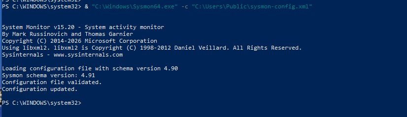

### 2. Xây dựng Bộ Custom Rules phát hiện Full Kill Chain (`local_rules.xml`)

Tại máy chủ **Wazuh Manager**, mở tệp [`custom-rules/local_rules.xml`](../../custom-rules/local_rules.xml) và bổ sung nhóm luật chuyên biệt bắt luồng sự kiện từ Sysmon EventChannel:

```xml
<group name="local_rules,sysmon,windows,killchain,">

  <!-- ===================================================================== -->
  <!-- STAGE 1: Malicious PowerShell Execution (T1059.001)                    -->
  <!-- ===================================================================== -->
  <rule id="100003" level="0">
    <if_sid>92021, 92066, 92031, 92032, 92052, 60000, 61603</if_sid>
    <description>Sysmon Event 1 Process Create Base Filter</description>
  </rule>

  <rule id="100004" level="12">
    <if_sid>100003</if_sid>
    <field name="win.system.message" type="pcre2">(?i)CommandLine:.*(-EncodedCommand|-enc|-w\s+hidden|-nop)</field>
    <description>CRITICAL WARNING: Malicious PowerShell Execution with Encoded/Hidden parameters detected!</description>
    <mitre>
      <id>T1059.001</id>
    </mitre>
  </rule>

  <!-- ===================================================================== -->
  <!-- STAGE 2: Privilege Escalation - UAC Bypass via Registry (T1548.002)   -->
  <!-- ===================================================================== -->
  <rule id="100007" level="12">
    <if_sid>61614, 61615, 61616</if_sid>
    <field name="win.system.message" type="pcre2">(?i)ms-settings</field>
    <description>CRITICAL WARNING: UAC Bypass attempt detected via ms-settings registry hijacking</description>
    <mitre>
      <id>T1548.002</id>
    </mitre>
  </rule>

  <!-- ===================================================================== -->
  <!-- STAGE 3: Persistence - Registry Run / RunOnce Keys (T1547.001)        -->
  <!-- ===================================================================== -->
  <rule id="100006" level="10">
    <if_sid>61614, 61615, 61616</if_sid>
    <field name="win.system.message" type="pcre2">(?i)CurrentVersion\\Run</field>
    <description>WARNING: Persistence Mechanism - Registry Run/RunOnce Key Created or Modified</description>
    <mitre>
      <id>T1547.001</id>
    </mitre>
  </rule>

  <!-- ===================================================================== -->
  <!-- STAGE 4: Credential Access - LSASS Memory Access (T1003.001)           -->
  <!-- ===================================================================== -->
  <rule id="100005" level="12">
    <if_sid>61612</if_sid>
    <field name="win.system.message" type="pcre2">(?i)TargetImage:.*lsass\.exe</field>
    <field name="win.system.message" type="pcre2" negate="yes">(?i)SourceImage:.*(MsMpEng\.exe|wmiprvse\.exe)</field>
    <description>CRITICAL WARNING: Suspicious Process Access to LSASS detected (Potential Credential Dumping)</description>
    <mitre>
      <id>T1003.001</id>
    </mitre>
  </rule>

</group>
```

Kiểm tra cú pháp và nạp cấu hình vào Wazuh Manager:
```bash
docker exec single-node-wazuh.manager-1 /var/ossec/bin/wazuh-analysisd -t
docker exec single-node-wazuh.manager-1 /var/ossec/bin/wazuh-control restart
```

---

## II. Chi tiết 4 Giai đoạn Mô phỏng & Bằng chứng Pháp y (PoC)

---

### 🔴 Giai đoạn 1: Execution (T1059.001 - Malicious PowerShell Execution)

#### 1. Hành vi mô phỏng
Kẻ tấn công sau khi có quyền truy cập sơ bộ sẽ thực thi các đoạn mã độc hại được làm rối (obfuscated) bằng cờ mã hóa Base64 `-EncodedCommand` kết hợp cờ ẩn cửa sổ `-WindowStyle Hidden` và bỏ qua cấu hình người dùng `-NoProfile`.
```powershell
powershell.exe -NoProfile -ExecutionPolicy Bypass -WindowStyle Hidden -EncodedCommand VwByAGkAdABlAC0ATwB1AHQAcAB1AHQAIAAiAFMATwBDAC0ATABhAGIAIABLAGkAbABsAEMAaABhAGkAbgAgAFMAdABhAGcAZQAxACAAVABlAHMAdAAgAEEAYwB0AGkAdgBlACI=
```
Sau khi thực thi lệnh thì hệ thống sẽ alert lên ngay lập tức lên Telegram:

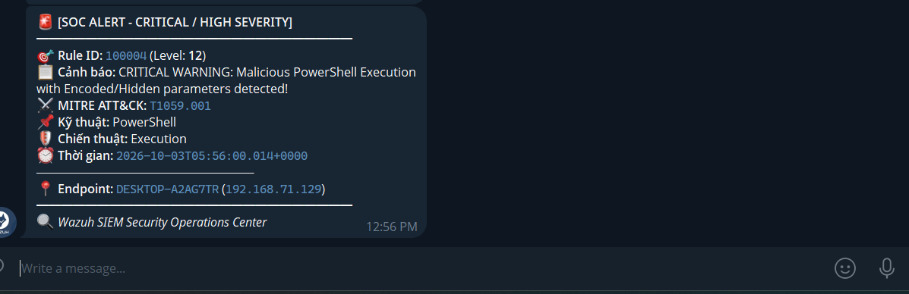

#### 2. Dấu vết Telemetry (Sysmon Event ID 1)
Sysmon ghi nhận sự kiện tạo tiến trình với chi tiết câu lệnh dòng lệnh:
* **Event ID:** 1 (Process Create)
* **Image:** `C:\Windows\System32\WindowsPowerShell\v1.0\powershell.exe`
* **CommandLine:** `powershell.exe -NoProfile -ExecutionPolicy Bypass -WindowStyle Hidden -EncodedCommand ...`
* **ParentImage:** `C:\Windows\System32\cmd.exe`

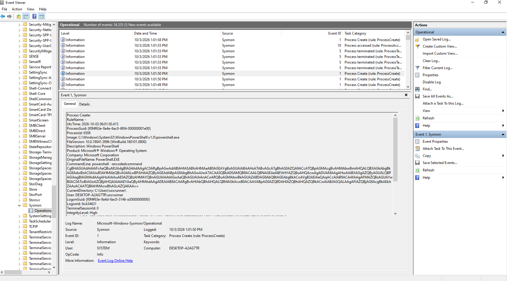

#### 3. Cảnh báo trên Wazuh SIEM
Hệ thống kích hoạt **Rule ID 100004 (Level 12 - High Severity)**:

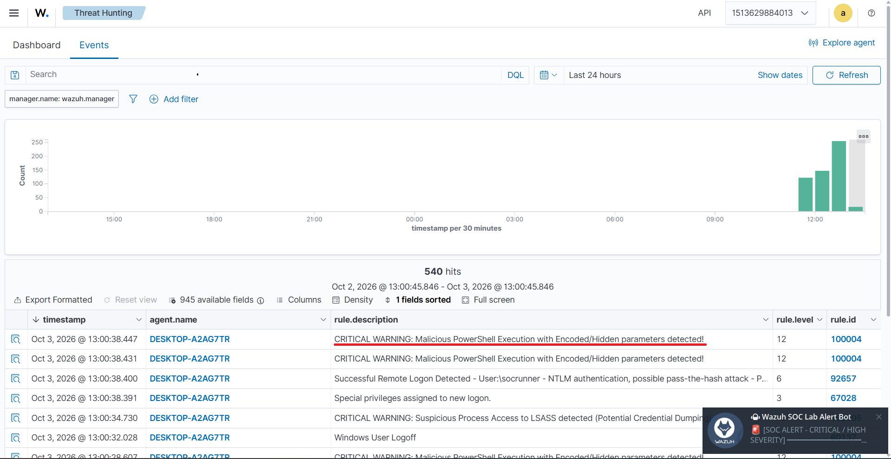
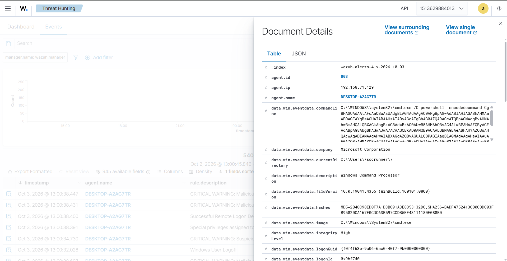

---

### 🔴 Giai đoạn 2: Privilege Escalation (T1548.002 - UAC Bypass via Registry)

#### 1. Hành vi mô phỏng
Kẻ tấn công lạm dụng kỹ thuật **Registry Hijacking** nhắm vào giao thức `ms-settings` (phương pháp chuẩn Atomic Red Team T1548.002). Bằng cách ghi đè khóa lệnh `HKCU\Software\Classes\ms-settings\Shell\Open\command`, các tiến trình tự động nâng quyền (auto-elevated process như `fodhelper.exe` hoặc `ComputerDefaults.exe`) sẽ thực thi mã độc với quyền Administrator mà không hiển thị hộp thoại UAC Prompt:
```powershell
$regPath = "HKCU:\Software\Classes\ms-settings\Shell\Open\command"
New-Item -Path $regPath -Force
Set-ItemProperty -Path $regPath -Name "DelegateExecute" -Value "" -Force
Set-Item -Path $regPath -Value "cmd.exe /c echo SOC_UAC_Bypass_Simulated" -Force
```
Thông báo trên Telegram: 
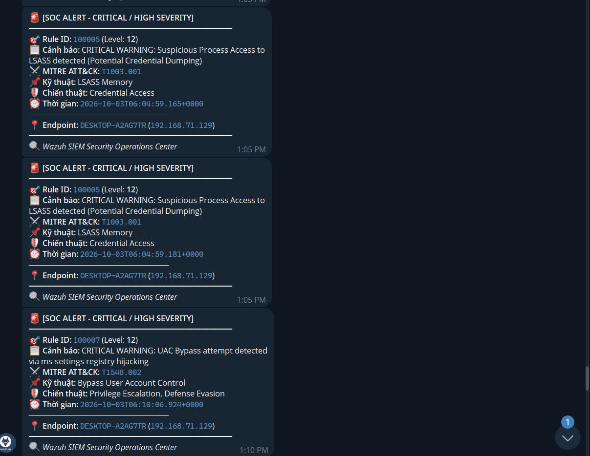


#### 2. Dấu vết Telemetry (Sysmon Event ID 12 & 13)
Sysmon lập tức tóm bắt sự kiện tương tác Registry:
* **Event ID:** 12 (CreateKey) & 13 (SetValue)
* **TargetObject:** `HKU\S-1-5-..._Classes\ms-settings\Shell\Open\command`
* **Details:** `cmd.exe /c echo SOC_UAC_Bypass_Simulated`

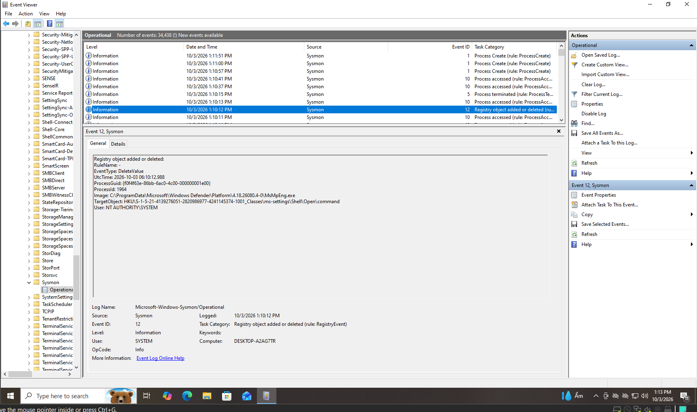

#### 3. Cảnh báo trên Wazuh SIEM
Hệ thống kích hoạt **Rule ID 100007 (Level 12 - High Severity)**:

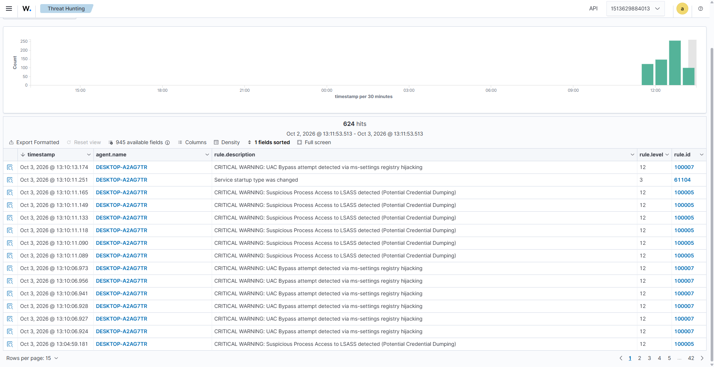

---

### 🔴 Giai đoạn 3: Persistence (T1547.001 - Registry Run Key Persistence)

#### 1. Hành vi mô phỏng
Kẻ tấn công thiết lập cơ chế tự khởi động khi người dùng đăng nhập hệ thống nhằm duy trì quyền kiểm soát vĩnh viễn (Persistence) bằng tiện ích dòng lệnh `reg.exe`:
```cmd
reg.exe add "HKCU\Software\Microsoft\Windows\CurrentVersion\Run" /v "SOCLabPersistTest" /t REG_SZ /d "C:\Windows\System32\cmd.exe /c echo soc_persist" /f
```

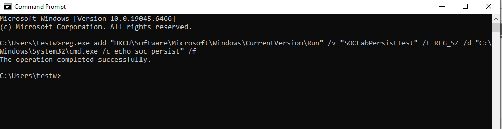

#### 2. Dấu vết Telemetry (Sysmon Event ID 13)
Sysmon ghi nhận giá trị Registry bị thay đổi:
* **Event ID:** 13 (SetValue)
* **Image:** `C:\Windows\system32\reg.exe`
* **TargetObject:** `HKU\S-1-5-...\SOFTWARE\Microsoft\Windows\CurrentVersion\Run\SOCLabPersistTest`
* **Details:** `C:\Windows\System32\cmd.exe /c echo soc_persist`

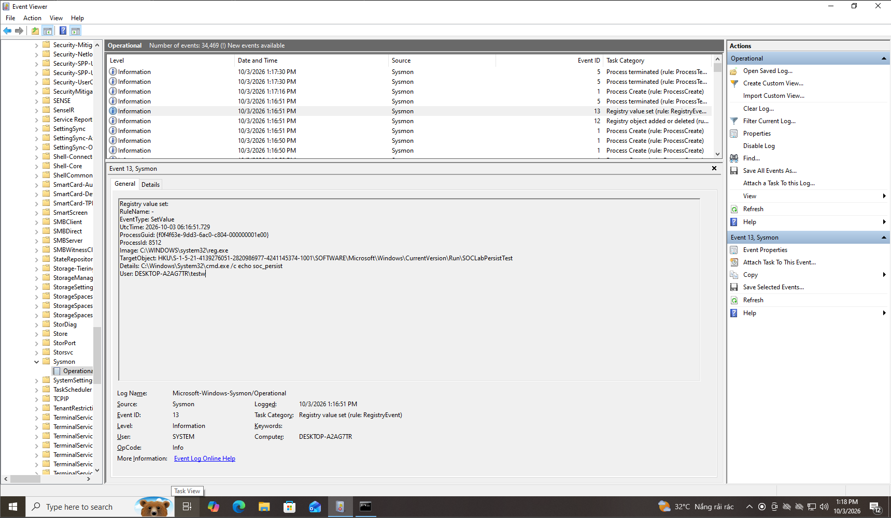

#### 3. Cảnh báo trên Wazuh SIEM
Hệ thống kích hoạt **Rule ID 100006 (Level 10 - Medium/High Severity)**:

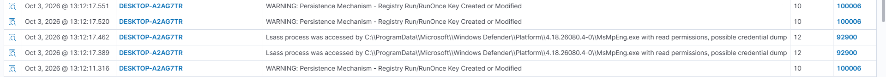

---

### 🔴 Giai đoạn 4: Credential Access (T1003.001 - LSASS Memory Access)

#### 1. Hành vi mô phỏng
Trong thực tế, tin tặc sử dụng Mimikatz, ProcDump hoặc Task Manager để dump bộ nhớ tiến trình `lsass.exe` (Local Security Authority Subsystem Service) nhằm đánh cắp NTLM hash và Kerberos tickets. 
Trong bài lab này, hành vi được mô phỏng một cách an toàn và chuẩn mực thông qua .NET Process Diagnostics API (gọi hàm Win32 `OpenProcess` mở handle đọc thông tin `lsass.exe`):
```powershell
$p = Get-Process -Name lsass -ErrorAction Stop
$h = $p.Handle
$id = $p.Id
$p.Dispose()
```

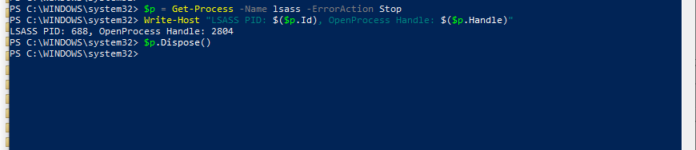

#### 2. Dấu vết Telemetry (Sysmon Event ID 10)
Sysmon chặn đứng và ghi lại sự kiện can thiệp bộ nhớ nhạy cảm:
* **Event ID:** 10 (ProcessAccess)
* **SourceImage:** `C:\Windows\System32\WindowsPowerShell\v1.0\powershell.exe`
* **TargetImage:** `C:\WINDOWS\system32\lsass.exe`
* **GrantedAccess:** Quyền truy cập đọc/truy vấn bộ nhớ.

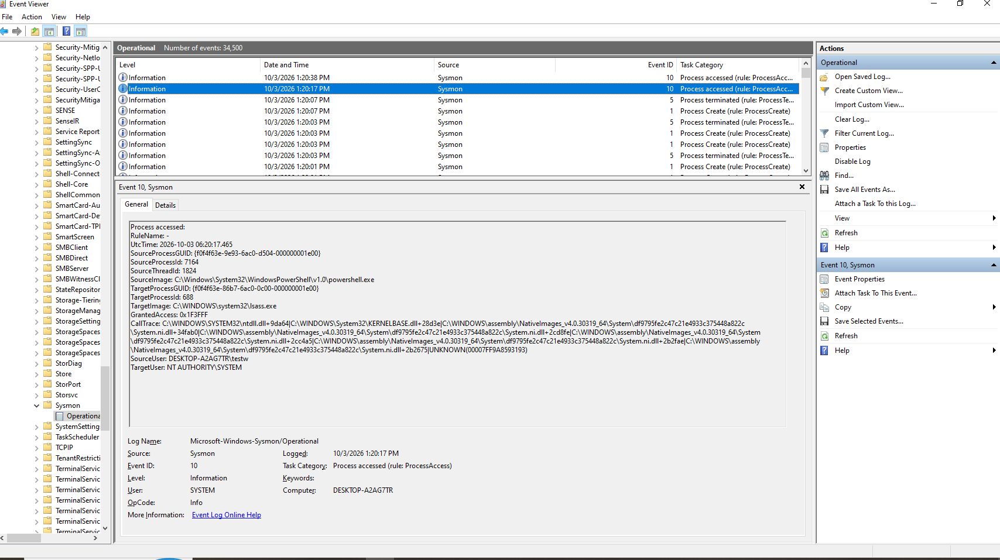

#### 3. Cảnh báo trên Wazuh SIEM
Hệ thống kích hoạt **Rule ID 100005 (Level 12 - High Severity)**:

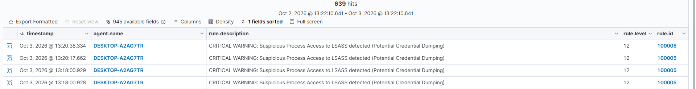

---

## III. Tự động hóa Kiểm thử End-to-End (E2E Runner) & ChatOps Telegram

### 1. Kịch bản Tự động hóa Toàn diện (`scenario_full_killchain.py`)

Toàn bộ quy trình từ thiết lập baseline, kích hoạt 4 giai đoạn tấn công, đối soát telemetry động và dọn dẹp môi trường được tích hợp trong file [`tests/e2e/scenario_full_killchain.py`](../../tests/e2e/scenario_full_killchain.py).

Thực thi kịch bản bằng lệnh:
```bash
python tests/e2e/scenario_full_killchain.py --execute
```


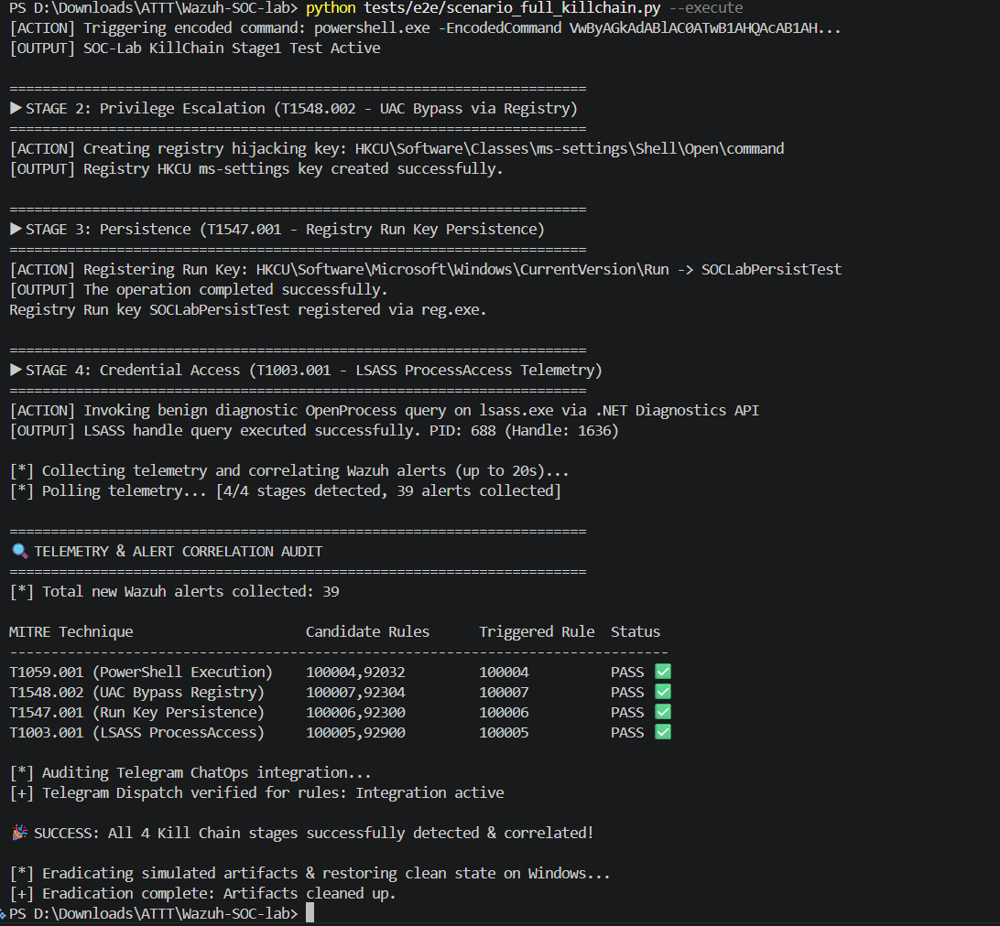

---

### 2. Thông báo Cảnh báo Realtime qua Telegram ChatOps

Tất cả các Rule `100004`, `100005`, `100006`, `100007` đều được cấu hình đẩy trực tiếp về Telegram Bot. Đội ngũ SOC tiếp nhận thông báo chi tiết bao gồm:
* Mức độ nghiêm trọng (Level 10 - 12).
* Tên kỹ thuật và mã ánh xạ **MITRE ATT&CK**.
* Tên endpoint và thông tin người dùng kích hoạt.
* Dấu vết tiến trình/khóa Registry vi phạm.
---

## IV. Điều tra Pháp y & Khắc phục Sự cố (Eradication & Remediation)

Sau khi cuộc tấn công diễn ra, kịch bản tự động thực thi chu trình phản ứng sự cố chuẩn (**NIST SP 800-61 / SANS**) để loại bỏ hoàn toàn các mối đe dọa:
1. **Xóa bỏ khóa UAC Bypass:** Xóa bỏ toàn bộ nhánh `HKCU:\Software\Classes\ms-settings` để ngăn ngừa việc lạm dụng tự động leo thang đặc quyền.
2. **Triệt tiêu khóa bám trụ (Run Key):** Sử dụng `reg.exe delete` loại bỏ giá trị `SOCLabPersistTest` khỏi `HKCU\...\CurrentVersion\Run`.
3. **Đóng Handle & Giải phóng tài nguyên:** Tiến trình PowerShell giải phóng handle đọc bộ nhớ `lsass.exe`, đảm bảo tính toàn vẹn của dịch vụ xác thực Windows.

Lệnh khắc phục thủ công:
```powershell
# 1. Eradicate UAC Bypass hijacking
Remove-Item -Path "HKCU:\Software\Classes\ms-settings" -Recurse -Force -ErrorAction SilentlyContinue

# 2. Eradicate Persistence Run Key
reg.exe delete "HKCU\Software\Microsoft\Windows\CurrentVersion\Run" /v "SOCLabPersistTest" /f
```

---

## V. Tổng kết Kịch bản 3

Kịch bản 3 đã chứng minh:
* **Khả năng giám sát chuyên sâu:** Sự kết hợp hoàn hảo giữa **Wazuh Agent** và **Microsoft Sysmon v15.2** giúp hệ thống SOC làm chủ hoàn toàn các hành vi bất thường ở tầng nhân hệ điều hành.
* **Bao phủ chuỗi tấn công hoàn chỉnh:** Không chỉ dừng lại ở các cuộc tấn công bên ngoài mạng, hệ thống có khả năng phát hiện xuyên suốt chuỗi vòng đời tấn công của kẻ xâm nhập (Execution $\rightarrow$ Privilege Escalation $\rightarrow$ Persistence $\rightarrow$ Credential Access).
* **Chuẩn hóa Detection-as-Code:** Quy trình kiểm thử được tự động hóa hoàn toàn với mã nguồn mở, tích hợp kiểm thử đơn vị (`pytest`) và kiểm thử đầu cuối (`E2E Runner`), sẵn sàng ứng dụng trong các trung tâm vận hành an ninh mạng (SOC/MDR) doanh nghiệp thực tế.

---

## References
* [MITRE ATT&CK T1059.001 - Command and Scripting Interpreter: PowerShell](https://attack.mitre.org/techniques/T1059/001/)
* [MITRE ATT&CK T1548.002 - Abuse Elevation Control Mechanism: Bypass User Account Control](https://attack.mitre.org/techniques/T1548/002/)
* [MITRE ATT&CK T1547.001 - Boot or Logon Autostart Execution: Registry Run Keys / Startup Folder](https://attack.mitre.org/techniques/T1547/001/)
* [MITRE ATT&CK T1003.001 - OS Credential Dumping: LSASS Memory](https://attack.mitre.org/techniques/T1003/001/)
* [Sysinternals Sysmon Documentation](https://learn.microsoft.com/en-us/sysinternals/downloads/sysmon)
