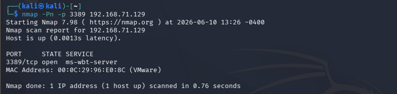
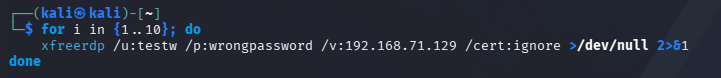
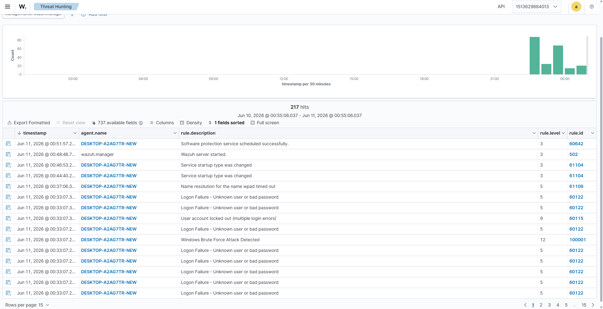
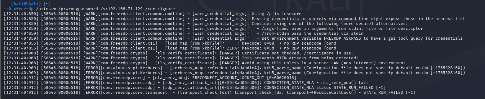
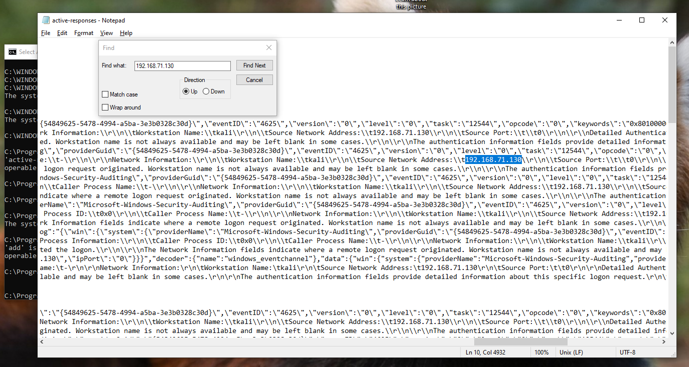

# CÁC KỊCH BẢN TẤN CÔNG & PHÁT HIỆN THỰC CHIẾN (PHASE 3)

## 🔹 KỊCH BẢN 1: T1110 - PHÁT HIỆN TẤN CÔNG BRUTE FORCE & TỰ ĐỘNG KHÓA IP (ACTIVE RESPONSE)

Kịch bản này chứng minh năng lực **Phản ứng chủ động (Active Response)** của hệ thống SIEM – không chỉ dừng lại ở việc phát hiện mà còn trực tiếp can thiệp vào tường lửa để cô lập kẻ tấn công ngay trong thời gian thực.

## Mục tiêu

Mục tiêu của Phase 3 - Kịch bản 1 là mô phỏng một cuộc tấn công Brute Force từ máy Kali Linux vào máy Windows Victim và sử dụng Wazuh để phát hiện các lần xác thực thất bại thông qua Windows Security Event Log.

Kết quả mong muốn:

* Windows Agent gửi log về Wazuh Manager.
* Wazuh phát hiện các lần đăng nhập thất bại.
* Xây dựng Custom Rule phát hiện Brute Force.
* Mapping với MITRE ATT&CK T1110 (Brute Force).

---

## Mô hình triển khai

Mô hình triển khai bao gồm ba thành phần chính:

```
                   ┌─────────────────────┐
                   │ Kali Linux          │
                   │ Attacker            │  
                   │ (IP: 192.168.71.130)│
                   └───────┬─────────────┘
                           │
                           │ RDP Brute Force
                           ▼
                   ┌──────────────────────┐
                   │ Windows 10           │
                   │ Wazuh Agent          │
                   │ (IP: 192.168.71.129) │
                   └───────┬──────────────┘
                           │
                           │ Security Logs
                           ▼
                   ┌─────────────────────────────┐
                   │ Wazuh Manager               │
                   │ Docker                      │
                   │ (Ubuntu IP: 192.168.71.128) │
                   └───────┬─────────────────────┘
                           │
                           │ Alerts
                           ▼
                   ┌───────────────┐
                   │ Dashboard     │
                   │ Threat Hunt   │
                   └───────────────┘
```
--- 
## I. Cấu hình Wazuh nhận biết Brute Force

### 1. Kiểm tra dịch vụ RDP

Từ Kali Linux tiến hành quét cổng RDP của máy Windows.
```bash
nmap -Pn -p 3389 192.168.71.129
```

Kết quả:
```text
3389/tcp open ms-wbt-server
```

=> Điều này xác nhận dịch vụ Remote Desktop đang hoạt động và sẵn sàng tiếp nhận kết nối từ xa.


---

### 2. Mô phỏng đăng nhập thất bại qua RDP

Sử dụng công cụ xfreerdp trên Kali Linux.
```bash
xfreerdp /u:testw /p:wrongpassword /v:192.168.71.129 /cert:ignore
```

Kết quả:
```text
ERRCONNECT_LOGON_FAILURE
```

=> Điều này chứng minh máy Windows đã tiếp nhận yêu cầu xác thực và từ chối đăng nhập do mật khẩu không chính xác.


### 3. Xây dựng Custom Rule phát hiện Brute Force

Bổ sung Rule trong file local_rules.xml, xem tại **link dẫn đến local_rules.xml trong custom-rules/**:

### 4. Mô phỏng tấn công Brute Force

Tiến hành gửi nhiều yêu cầu xác thực sai liên tiếp.
```bash
for i in {1..10}; do
    xfreerdp /u:testw \
             /p:wrongpassword \
             /v:192.168.71.129 \
             /cert:ignore
done
```

Lệnh trên tạo ra nhiều sự kiện đăng nhập thất bại trong thời gian ngắn trên hệ thống Windows.


---

### 5. Kiểm tra Event Log trên Windows

Sau khi thực hiện tấn công mô phỏng, kiểm tra Security Event Log.
```powershell
Get-WinEvent -FilterHashtable @{LogName='Security'; Id=4625}
```

Kết quả xuất hiện nhiều sự kiện:
```text
Event ID: 4625
An account failed to log on
```

Event ID 4625 là sự kiện chuẩn của Windows dùng để ghi nhận các lần đăng nhập thất bại.


---

### 6. Phân tích log trên Wazuh Dashboard

Truy cập Threat Hunting và ta thấy được rule.id là 100001 ta vừa tạo

```text
Windows Brute Force Attack Detected
Rule ID: 100001
Level : 12
```



---


## II. Triển khai cấu hình tự động khóa IP (Active Response)

Để nâng cấp hệ thống từ năng lực giám sát bị động sang phòng thủ chủ động, cơ chế **Active Response** được tích hợp nhằm ra lệnh cho Windows Agent tự động kích hoạt tường lửa, cách ly hoàn toàn IP của kẻ tấn công ngay khi Rule `100001` bị kích hoạt.

### Bước 1: Cấu hình Active Response trên Wazuh Manager (Ubuntu)

Để đảm bảo an toàn hệ thống và tránh các lỗi phân quyền làm ảnh hưởng đến tiến trình ngầm (`wazuh-db`), quy trình trích xuất, chỉnh sửa và đẩy đè file cấu hình từ máy thật Ubuntu vào Docker được thực hiện như sau:

1. **Trích xuất file cấu hình gốc:** Tại Terminal của máy Ubuntu, chạy lệnh sao chép file cấu hình tổng quát từ bên trong Container ra bên ngoài:
```bash
sudo docker cp single-node-wazuh.manager-1:/var/ossec/etc/ossec.conf ./ossec.conf.bak
```


2. **Chỉnh sửa file cấu hình:** Mở file `ossec.conf.bak` vừa copy ra bằng trình soạn thảo `gedit`:
```bash
gedit ./ossec.conf.bak
```


Kéo xuống cuối file, tìm đến trước thẻ đóng `</ossec_config>` và chèn đoạn cấu hình Active Response gọi lệnh `netsh` của Windows vào:
```xml
  <active-response>
    <command>netsh</command>
    <location>local</location> 
    <rules_id>100001</rules_id>
    <timeout>600</timeout> 
  </active-response>
```


*Nhấn **Save** và tắt trình soạn thảo.*
3. **Đẩy file vào Container và thiết lập phân quyền nghiêm ngặt:** Chạy chuỗi lệnh sau để cập nhật file, gán lại quyền sở hữu chính chủ cho user `wazuh` trong Docker để tránh lỗi sập dịch vụ:
```bash
# Đẩy file đã cấu hình vào lòng container
sudo docker cp ./ossec.conf.bak single-node-wazuh.manager-1:/var/ossec/etc/ossec.conf

# Sửa quyền sở hữu và quyền đọc ghi ngay lập tức
sudo docker exec -it single-node-wazuh.manager-1 chown wazuh:wazuh /var/ossec/etc/ossec.conf
sudo docker exec -it single-node-wazuh.manager-1 chmod 660 /var/ossec/etc/ossec.conf

# Khởi động lại nội bộ Wazuh để áp dụng cấu hình mới tinh
sudo docker exec -it single-node-wazuh.manager-1 /var/ossec/bin/wazuh-control restart
```

### Bước 2: Kích hoạt quyền thực thi lệnh trên Windows Agent

Mặc định, nhằm đảm bảo an toàn, Wazuh Agent trên Windows sẽ khóa không cho phép Manager ra lệnh chạy script từ xa. Cần mở khóa tính năng này cục bộ trên máy nạn nhân:

1. Trên máy **Windows 10 Victim**, mở Notepad với quyền Quản trị viên (**Run as Administrator**).
2. Mở tệp tin theo đường dẫn: `C:\Program Files (x86)\ossec-agent\local_internal_options.conf`.
3. Di chuyển xuống cuối file, chèn thêm dòng lệnh sau để cho phép nhận lệnh từ xa:
```text
wazuh_command.remote_commands=1
```


4. Lưu file lại (`Ctrl + S`).
5. Mở Command Prompt (CMD) quyền Admin trên Windows và thực hiện tái khởi động dịch vụ Agent:
```cmd
NET STOP WazuhSvc && NET START WazuhSvc
```
---

### Bước 3: Kiểm chứng thực tế và Thu nhập minh chứng pháp y (PoC)

Sau khi hạ tầng SIEM và Agent Windows đã thông suốt cấu hình, tiến hành kích hoạt lại kịch bản tấn công Brute Force từ máy **Kali Linux** bằng lệnh vòng lặp giãn cách:

```bash
for i in {1..10}; do xfreerdp /u:testw /p:wrongpassword /v:192.168.71.129 /cert:ignore; sleep 1; done
```



Đến khoảng lần thử thứ 6 hoặc thứ 8, khi số lượng log Event ID 4625 đẩy về dồn dập làm kích hoạt Rule `100001`, cơ chế phản kháng lập tức nổ ra. Hệ thống Windows từ chối xác thực ngay từ tầng mạng (NLA) và trả thẳng về Terminal của Kali Linux mã lỗi hệ thống chí mạng:

```text
[ERROR][com.freerdp.core] - [nla_recv_pdu]: ERRCONNECT_ACCOUNT_LOCKED_OUT [0x00020018]
```

Điều này chứng minh cuộc tấn công Brute Force đã bị bẻ gãy hoàn toàn, hacker không thể tiếp tục thực hiện hành vi dò quét mật khẩu.




Kiểm tra file nhật ký thực thi Active Response của Agent tại đường dẫn `C:\Program Files (x86)\ossec-agent\active-responses.log` trên máy **Windows 10**, hệ thống ghi nhận dòng log thực thi tệp tin hệ thống theo thời gian thực:

```text
active-response/bin/netsh.exe add - 192.168.71.130
```

Log này chứng minh Agent đã tiếp nhận lệnh từ bộ não SIEM Ubuntu thành công và lập tức gọi `netsh.exe` để thiết lập hàng rào bảo vệ.


Truy cập vào giao diện quản trị *Windows Defender Firewall with Advanced Security* $\rightarrow$ *Inbound Rules* trên máy nạn nhân. Hệ thống tự động sinh ra một quy tắc khẩn cấp mang tên **`WAZUH ACTIVE RESPONSE BLOCKED IP`**. Khi kiểm tra thuộc tính trong tab *Scope*, địa chỉ IP của máy Kali Linux (`192.168.71.130`) đã bị ghim chặt vào danh sách cấm (**Block**) kết nối.


Trên giao diện **Wazuh Dashboard** (`Threat Hunting` $\rightarrow$ `Events`), song song với cảnh báo đỏ rực mức độ 12 của Rule `100001` phát hiện Brute Force, hệ thống đồng thời ghi nhận một Alert mức độ 3 xác nhận lệnh phản kháng đã được thực thi thành công:

```text
Active response: active-response/bin/netsh.exe - add
Rule ID: 657
```

---

## III. Tổng kết kịch bản 1

Kịch bản mô phỏng tấn công Brute Force RDP và kích hoạt Active Response. Hệ thống SIEM triển khai trên Docker không những chứng minh khả năng thu thập log tập trung, phân tích cú pháp thông qua Custom Rule chuẩn định dạng MITRE ATT&CK T1110, mà còn thực thi kịch bản tự động cô lập nguồn nguy hại (Soar Automation Capabilities), bảo vệ an toàn tuyệt đối cho tài nguyên máy trạm Windows.


## References
- https://attack.mitre.org/techniques/T1110/