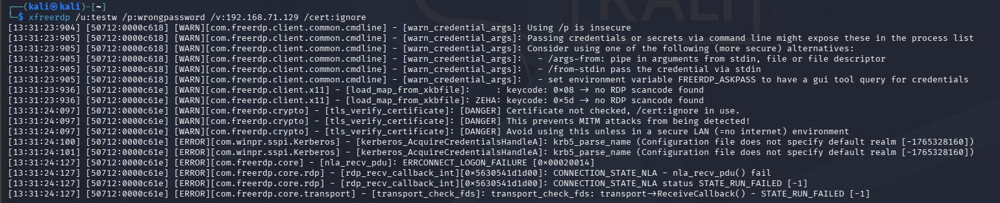
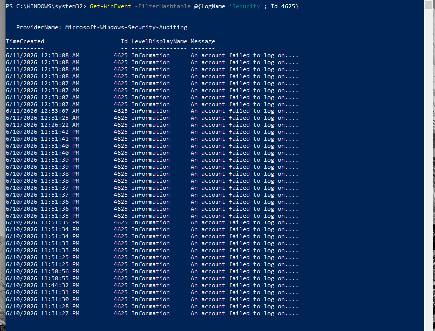
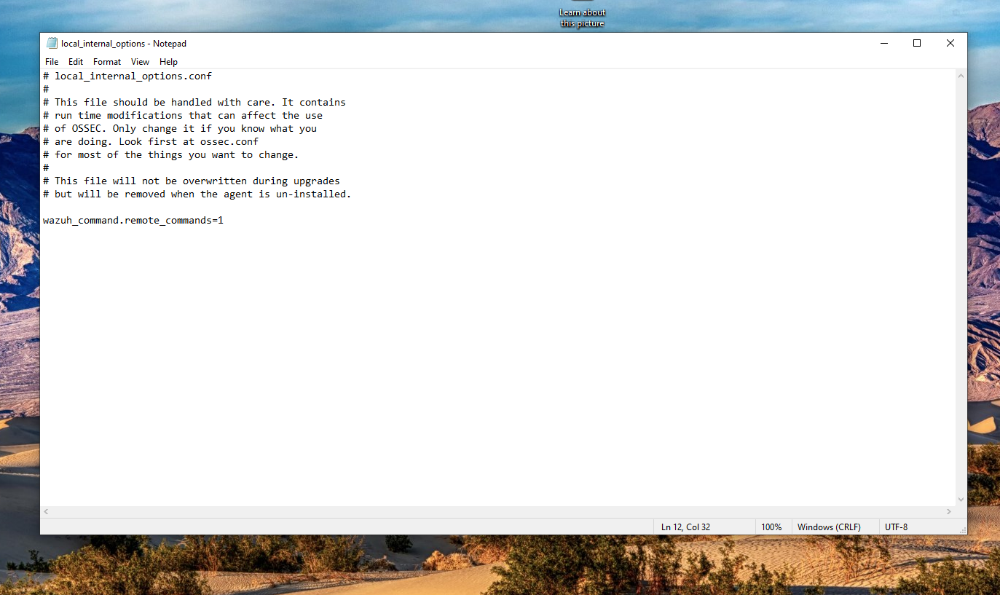

# Attack Scenarios &amp; Real-World Detection (Phase 3)

## 🔹 Scenario 1: T1110 - Detect Brute Force Attack &amp; Auto-Block IP (Active Response)

This scenario demonstrates the SIEM system's **Active Response** capability – not just stopping at detection but also directly intervening in the firewall to isolate the attacker in real time.

## Objective

The objective of Phase 3 - Scenario 1 is to simulate a Brute Force attack from Kali Linux to the Windows Victim machine and use Wazuh to detect failed authentication attempts via Windows Security Event Log.

Expected results:

* Windows Agent sends logs to Wazuh Manager.
* Wazuh detects failed login attempts.
* Build Custom Rule to detect Brute Force.
* Map with MITRE ATT&amp;CK T1110 (Brute Force).

---

## Deployment Model

Deployment model includes three main components:

```
                    ┌─────────────────────┐
                    │ Kali Linux          │
                    │ Attacker            │  
                    │ (IP: 192.168.71.130)│
                    └───────┬─────────────┘
                            │
                            │ RDP Brute Force
                            ▼
                    ┌──────────────────────┐
                    │ Windows 10           │
                    │ Wazuh Agent          │
                    │ (IP: 192.168.71.129) │
                    └───────┬──────────────┘
                            │
                            │ Security Logs
                            ▼
                    ┌─────────────────────────────┐
                    │ Wazuh Manager               │
                    │ Docker                      │
                    │ (Ubuntu IP: 192.168.71.128) │
                    └───────┬─────────────────────┘
                            │
                            │ Alerts
                            ▼
                    ┌───────────────┐
                    │ Dashboard     │
                    │ Threat Hunt   │
                    └───────────────┘
```
--- 
## I. Configure Wazuh to Recognize Brute Force

### 1. Check RDP Service

From Kali Linux proceed to scan Windows machine's RDP port.
```bash
nmap -Pn -p 3389 192.168.71.129
```

Result:
```text
3389/tcp open ms-wbt-server
```

=&gt; This confirms Remote Desktop service is active and ready to receive remote connections.


---

### 2. Simulate Failed Login via RDP

Use xfreerdp tool on Kali Linux.
```bash
xfreerdp /u:testw /p:wrongpassword /v:192.168.71.129 /cert:ignore
```

Result:
```text
ERRCONNECT_LOGON_FAILURE
```

=&gt; This proves Windows machine received authentication request and rejected login due to incorrect password.


### 3. Build Custom Rule to Detect Brute Force

Add Rule in local_rules.xml file, see at **link to local_rules.xml in custom-rules/**:

### 4. Simulate Brute Force Attack

Proceed to send many consecutive wrong authentication requests.
```bash
for i in {1..10}; do
    xfreerdp /u:testw \
             /p:wrongpassword \
             /v:192.168.71.129 \
             /cert:ignore
done
```

Above command generates many failed login events in short time on Windows system.


---

### 5. Check Event Log on Windows

After performing simulated attack, check Security Event Log.
```powershell
Get-WinEvent -FilterHashtable @{LogName='Security'; Id=4625}
```

Result shows many events:
```text
Event ID: 4625
An account failed to log on
```

Event ID 4625 is Windows standard event used to record failed login attempts.


---

### 6. Analyze Logs on Wazuh Dashboard

Access Threat Hunting and we see rule.id is 100001 we just created

```text
Windows Brute Force Attack Detected
Rule ID: 100001
Level : 12
```


---


## II. Deploy Auto-Block IP Configuration (Active Response)

To upgrade the system from passive monitoring capability to active defense, **Active Response** mechanism is integrated to instruct Windows Agent to automatically activate firewall, completely isolating attacker's IP immediately upon Rule `100001` being triggered.

### Step 1: Configure Active Response on Wazuh Manager (Ubuntu)

To ensure system security and avoid permission errors affecting background process (`wazuh-db`), workflow to extract, edit and push configuration file from Ubuntu real machine to Docker is performed as follows:

1. **Extract original configuration file:** On Ubuntu's Terminal, run command to copy general configuration file from inside Container to outside:
```bash
sudo docker cp single-node-wazuh.manager-1:/var/ossec/etc/ossec.conf ./ossec.conf.bak
```


2. **Edit configuration file:** Open `ossec.conf.bak` file just copied out with `gedit` editor:
```bash
gedit ./ossec.conf.bak
```


Scroll to end of file, find before closing `</ossec_config>` tag and insert Active Response configuration block calling Windows' `netsh` command:
```xml
  &lt;active-response&gt;
    &lt;command&gt;netsh&lt;/command&gt;
    &lt;location&gt;local&lt;/location&gt; 
    &lt;rules_id&gt;100001&lt;/rules_id&gt;
    &lt;timeout&gt;600&lt;/timeout&gt; 
  &lt;/active-response&gt;
```


*Press **Save** and close editor.*
3. **Push file into Container and set strict permissions:** Run following command chain to update file, reassign correct ownership to `wazuh` user in Docker to avoid service crash error:
```bash
# Push configured file into container core
sudo docker cp ./ossec.conf.bak single-node-wazuh.manager-1:/var/ossec/etc/ossec.conf

# Change ownership and read-write permissions immediately
sudo docker exec -it single-node-wazuh.manager-1 chown wazuh:wazuh /var/ossec/etc/ossec.conf
sudo docker exec -it single-node-wazuh.manager-1 chmod 660 /var/ossec/etc/ossec.conf

# Restart Wazuh internally to apply new fine-tuned configuration
sudo docker exec -it single-node-wazuh.manager-1 /var/ossec/bin/wazuh-control restart
```

### Step 2: Activate Command Execution Permission on Windows Agent

By default, to ensure security, Wazuh Agent on Windows will lock and not allow Manager to issue remote script execution commands. Need to unlock this feature locally on victim machine:

1. On **Windows 10 Victim** machine, open Notepad with **Run as Administrator** privileges.
2. Open file at path: `C:\Program Files (x86)\ossec-agent\local_internal_options.conf`.
3. Navigate to end of file, insert additional following command line to allow receiving remote commands:
```text
wazuh_command.remote_commands=1
```


4. Save file (`Ctrl + S`).
5. Open Command Prompt (CMD) with Admin privileges on Windows and perform Agent service restart:
```cmd
NET STOP WazuhSvc &amp;&amp; NET START WazuhSvc
```
---

### Step 3: Validate Practicality and Collect Forensic Evidence (PoC)

After SIEM infrastructure and Windows Agent have synchronized configuration, proceed to reactivate Brute Force attack scenario from **Kali Linux** machine with spaced loop command:

```bash
for i in {1..10}; do xfreerdp /u:testw /p:wrongpassword /v:192.168.71.129 /cert:ignore; sleep 1; done
```


Around 6th or 8th attempt, when number of Event ID 4625 logs pushed in dense triggers Rule `100001`, defense mechanism immediately detonates. Windows system rejects authentication right from network layer (NLA) and returns straight to Kali Linux's Terminal with system network error code:

```text
[ERROR][com.freerdp.core] - [nla_recv_pdu]: ERRCONNECT_ACCOUNT_LOCKED_OUT [0x00020018]
```

This proves Brute Force attack has been completely broken, hacker cannot continue performing password guessing behavior.


Check Agent's Active Response execution log file at path `C:\Program Files (x86)\ossec-agent\active-responses.log` on **Windows 10** machine, system records log line executing system file in real time:

```text
active-response/bin/netsh.exe add - 192.168.71.130
```

This log proves Agent successfully received command from Ubuntu SIEM brain and immediately called `netsh.exe` to set up protective barrier.


Access *Windows Defender Firewall with Advanced Security* → *Inbound Rules* management interface on victim machine. System automatically generates an emergency rule named **`WAZUH ACTIVE RESPONSE BLOCKED IP`**. When checking properties in *Scope* tab, Kali Linux machine's IP address (`192.168.71.130`) has been firmly pinned to blocked connection list (**Block**).


On **Wazuh Dashboard** interface (`Threat Hunting` → `Events`), parallel to bright red alert of Rule `100001` level 12 detecting Brute Force, system simultaneously records a level 3 Alert confirming defense command was executed successfully:

```text
Active response: active-response/bin/netsh.exe - add
Rule ID: 657
```

---

## III. Summary of Scenario 1

Scenario simulates RDP Brute Force attack and activates Active Response. SIEM infrastructure deployed on Docker not only demonstrates centralized log collection capability, syntax analysis via Custom Rule standardized in MITRE ATT&amp;CK T1110 format, but also executes automatic isolation workflow of threat source (SOAR Automation Capabilities), absolutely protecting Windows endpoint resources.


## References
- https://attack.mitre.org/techniques/T1110/
