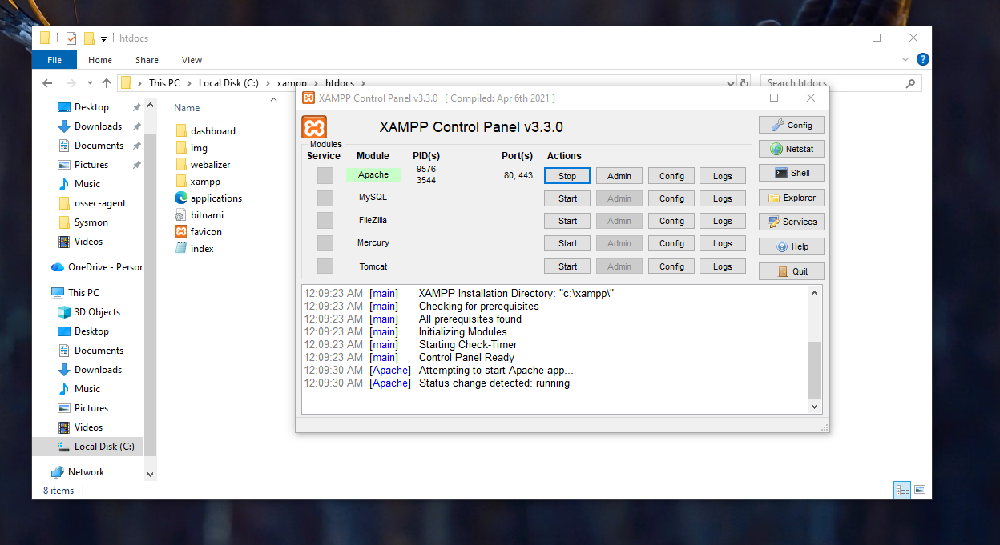
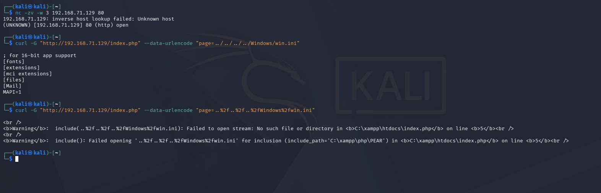
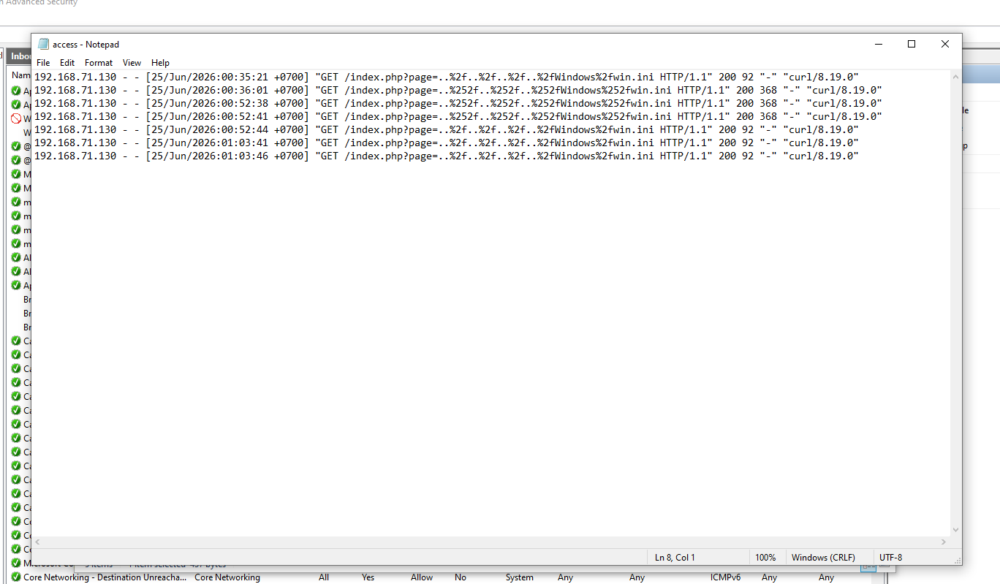
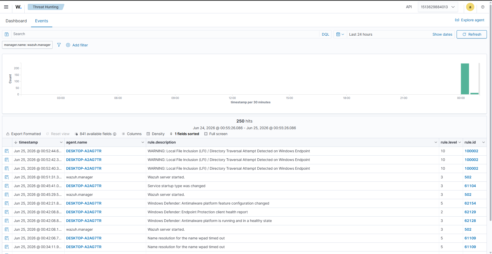
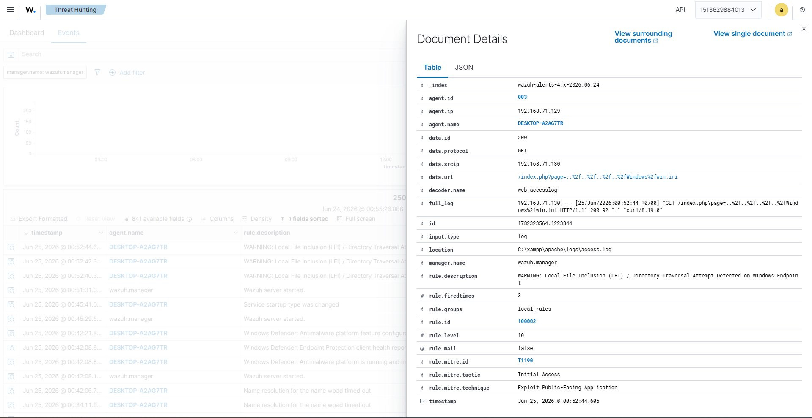
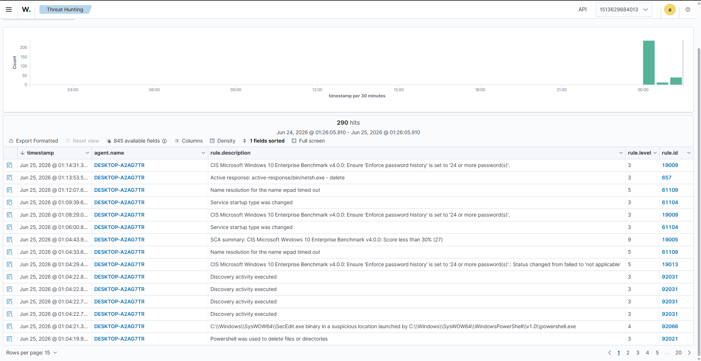
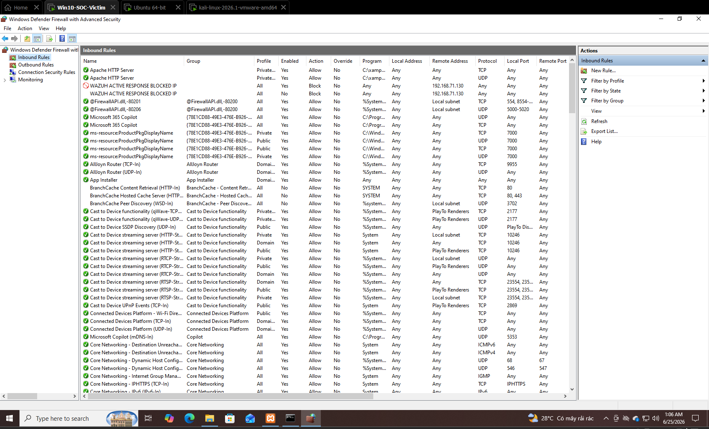
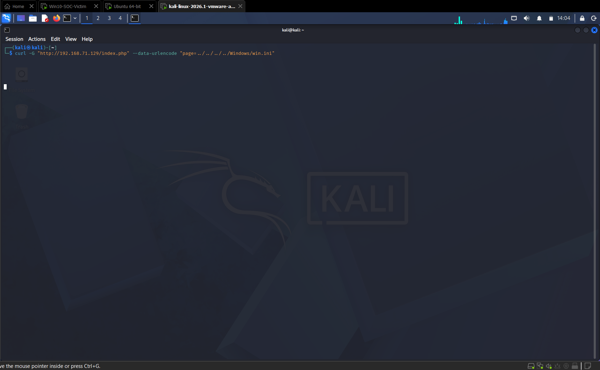

# CÁC KỊCH BẢN TẤN CÔNG & PHÁT HIỆN THỰC CHIẾN (PHASE 3)

## 🔹 KỊCH BẢN 2: T1190 - KHAI THÁC LỖ HỔNG ỨNG DỤNG WEB (LOCAL FILE INCLUSION - LFI / DIRECTORY TRAVERSAL)

Kịch bản này phân tích cú pháp ký tự lạ bằng biểu thức chính quy nâng cao, kỹ thuật cấu hình thu thập tệp tin log từ ứng dụng bên thứ ba, viết **Custom Decoders / Custom Rules** đè hệ thống, và tích hợp giải pháp phòng thủ chủ động **Active Response** của một Kỹ sư Phát hiện (Detection Engineer) nhằm bảo vệ ứng dụng hướng ra bên ngoài.

## Mục tiêu

* **Mục tiêu giả lập (Attacker's Goal):** Kẻ tấn công nhắm vào chiến thuật **Initial Access (Tiếp cận ban đầu)** thông qua kỹ thuật **`T1190 - Exploit Public-Facing Application`**. Bằng cách khai thác lỗ hổng Local File Inclusion (LFI) / Directory Traversal trên ứng dụng Web hướng ra ngoài biên (Apache), hacker cố gắng đọc trộm các tệp tin cấu hình nhạy cảm (`win.ini`) của hệ điều hành để thu thập thông tin trinh sát.
* **Mục tiêu kiểm chứng hệ thống (SIEM/SOC Validation Goal):**
* Kiểm chứng năng lực giám sát log ứng dụng từ bên thứ ba (XAMPP Apache) thông qua cấu hình đường ống thu thập của Wazuh Agent.
* Đánh giá độ nhạy và tính chính xác của **Custom Decoder** trong việc bóc tách các tham số URL phức tạp.
* Thử nghiệm năng lực phân tích của **Custom Rule (PCRE2 Regex)** trước các kỹ thuật ẩn mình, xáo trộn chuỗi của hacker như mã hóa đơn (`%2f`) và mã hóa kép (`%252f`).
* Xác tồn cơ chế **Active Response**, kích hoạt tường lửa Windows Defender Firewall (`netsh.exe`) để tự động cô lập, chặn đứng IP nguồn tấn công theo thời gian thực.


## I. Cấu hình Web Server và Đường ống thu thập Log

### 1. Dựng môi trường ứng dụng Web dính lỗ hổng LFI

Để có môi trường sinh log truy cập Web cho Wazuh, một Web Server Apache cục bộ được cấu hình thông qua gói XAMPP đặt tại đường dẫn `C:\xampp` trên máy Windows 10 Victim nhằm tránh xung đột quyền hạn UAC.

Tại thư mục mã nguồn `C:\xampp\htdocs\`, xây dựng tệp tin mã nguồn tên `index.php` chứa lỗ hổng không kiểm duyệt tham số đầu vào đi thẳng vào hàm nạp hệ thống:

```php
<?php
    // Lỗ hổng LFI: Lấy trực tiếp tham số 'page' từ URL và nạp vào hàm include mà không kiểm tra đầu vào
    if (isset($_GET['page'])) {
        $file = $_GET['page'];
        include($file);
    } else {
        echo "<h1>Welcome to My Public Web Application</h1>";
    }
?>
```

Kích hoạt dịch vụ **Apache** từ giao diện điều khiển XAMPP Control Panel, đảm bảo trạng thái chuyển sang màu xanh lá và lắng nghe trên cổng mặc định (80, 443).


### 2. Điều hướng Wazuh Agent thu thập nhật ký truy cập

Để chuyển tiếp luồng sự kiện Web về trung tâm phân tích, can thiệp vào file cấu hình tổng của Agent bằng quyền quản trị:

```cmd
notepad "C:\Program Files (x86)\ossec-agent\ossec.conf"
```

Bổ sung khối định vị giám sát tệp tin nhật ký cục bộ của Apache vào phân vùng cấu hình:

```xml
<localfile>
  <log_format>syslog</log_format>
  <location>C:\xampp\apache\logs\access.log</location>
</localfile>
```

Thực hiện tái khởi động dịch vụ Agent từ cửa sổ Command Prompt quyền Administrator để chính thức kích hoạt đường ống đẩy log:

```cmd
NET STOP WazuhSvc && NET START WazuhSvc
```

---

## II. Xây dựng cấu hình phát hiện LFI nâng cao trên Wazuh Manager

### 1. Viết Custom Decoder bóc tách chuyên sâu tham số URL

Mặc định Wazuh sử dụng bộ giải mã `web-accesslog` để xử lý log Apache. Để phục vụ riêng cho bài toán bóc tách payload thô đằng sau phương thức `GET`, tiến hành trích xuất và bổ sung bộ giải mã tùy biến tại file `local_decoder.xml` trong Docker Container:

```bash
sudo docker cp single-node-wazuh.manager-1:/var/ossec/etc/decoders/local_decoder.xml ./local_decoder.xml.bak
```

Cấu hình biểu thức chính quy (Regex) bóc tách toàn bộ chuỗi tham số độc hại gán vào trường dữ liệu biến động:

```xml
<decoder name="web-access-lfi">
  <parent>web-accesslog</parent>
  <regex>GET (\S+)\sHTTP</regex>
  <order>url</order>
</decoder>
```

### 2. Xây dựng hệ thống luật phòng chống Bypass (Double Encoding)

Hacker thường sử dụng các kỹ thuật xáo trộn chuỗi như mã hóa đơn (`%2f`) hoặc mã hóa kép (`%252f`) để vượt qua các bộ luật thông thường. Thực hiện sao chép file luật để bổ sung bộ lọc có độ phủ rộng:

```bash
sudo docker cp single-node-wazuh.manager-1:/var/ossec/etc/rules/local_rules.xml ./local_rules.xml.bak
```

```xml
<group name="web,attack,lfi,">
  <rule id="100002" level="10" overwrite="yes">
    <if_sid>31100</if_sid>
    <match>win.ini|boot.ini|..%2f|..%252f|../</match>
    <description>WARNING: Local File Inclusion (LFI) / Directory Traversal Attempt Detected on Windows Endpoint</description>
    <mitre>
      <id>T1190</id>
    </mitre>
  </rule>
</group>
```

Đồng bộ các file cấu hình đã sửa đổi vào lại Container, áp đặt quyền sở hữu nghiêm ngặt cho người dùng `wazuh` và thực hiện khởi động lại:

```bash
sudo docker cp ./local_decoder.xml.bak single-node-wazuh.manager-1:/var/ossec/etc/decoders/local_decoder.xml
sudo docker cp ./local_rules.xml.bak single-node-wazuh.manager-1:/var/ossec/etc/rules/local_rules.xml

sudo docker exec -it single-node-wazuh.manager-1 chown wazuh:wazuh /var/ossec/etc/decoders/local_decoder.xml /var/ossec/etc/rules/local_rules.xml
sudo docker exec -it single-node-wazuh.manager-1 chmod 660 /var/ossec/etc/decoders/local_decoder.xml /var/ossec/etc/rules/local_rules.xml

sudo docker exec -it single-node-wazuh.manager-1 /var/ossec/bin/wazuh-control restart
```

---

## III. Triển khai cấu hình tự động khóa IP (Active Response)

Nhằm nâng cấp hệ thống lên năng lực phản ứng sự cố tự động (SOAR Capabilities), cấu hình cơ chế phản kháng để chỉ thị cho Agent tự động khóa cứng IP kẻ tấn công thông qua Windows Defender Firewall.

### 1. Cấu hình Active Response trên Wazuh Manager

Trích xuất tệp cấu hình trung tâm `ossec.conf` từ Docker ra máy trạm Ubuntu:

```bash
sudo docker cp single-node-wazuh.manager-1:/var/ossec/etc/ossec.conf ./ossec.conf.bak
```

Di chuyển đến phân vùng quản trị phản kháng, bổ sung khối cấu hình liên kết trực tiếp với Rule `100002` vừa tạo, sử dụng lệnh hệ thống `netsh` với thời gian cách ly tạm thời là 10 phút (600 giây):

```xml
  <active-response>
    <command>netsh</command>
    <location>local</location> 
    <rules_id>100002</rules_id>
    <timeout>600</timeout> 
  </active-response>
```

Đẩy đè tệp cấu hình trở lại container và thực hiện áp quyền, tái khởi động như trên.
---

## IV. Kiểm chứng thực tế và Thu nhập minh chứng pháp y (PoC)

> ⚠️ **Lưu ý thực chiến:** Trước khi triển khai kiểm thử, truy cập vào giao diện tường lửa `wf.msc` trên máy Windows Victim để xóa bỏ hoặc hủy kích hoạt (Disable) các quy tắc chặn cũ `Wazuh_ActiveResponse_...` do kịch bản 1 để lại nhằm giải phóng quyền truy cập cho máy Kali.

### 1. Giả lập khai thác LFI từ máy tấn công Kali Linux

Từ máy Kali Linux (`192.168.71.130`), tiến hành phát lệnh khai thác sử dụng tham số kiểm dò thô:

```bash
curl -G "http://192.168.71.129/index.php" --data-urlencode "page=../../../../Windows/win.ini"
```

Kết quả in thẳng nội dung file cấu hình bảo mật `win.ini` của Windows lên màn hình, chứng thực lỗ hổng bị khai thác thành công:

```text
; for 16-bit app support
[fonts]
[extensions]
```

Tiếp tục giả lập kỹ thuật ẩn mình tinh vi bằng đòn tấn công mã hóa kép (Double Encoding):

```bash
curl -G "http://192.168.71.129/index.php" --data-urlencode "page=..%252f..%252f..%252fWindows%252fwin.ini"
```

Mặc dù ứng dụng trả về cảnh báo lỗi do không tự giải mã chuỗi từ hàm `include()`, tuy nhiên toàn bộ chuỗi dấu vết độc hại gài bẫy này đã bị tóm gọn và ghi nhận toàn vẹn vào file nhật ký `access.log` của Apache.

### 2. Xác thực cấu trúc phân tích thông qua `wazuh-logtest`

Gọi công cụ kiểm thử nội bộ trên Ubuntu Manager để đánh giá chất lượng phân tích dòng log độc hại:

```bash
sudo docker exec -it single-node-wazuh.manager-1 /var/ossec/bin/wazuh-logtest
```

Dán dòng log Double Encoding thực tế ghi nhận từ Apache vào, kết quả cho thấy `Phase 2` giải mã bóc tách thành công tham số độc hại sang trường `url`, và `Phase 3` lọc trúng đích **Rule 100002** mức độ 10:

```text
**Phase 2: Completed decoding.
	name: 'web-accesslog'
	url: '/index.php?page=..%252f..%252f..%252fWindows%252fwin.ini'

**Phase 3: Completed filtering (rules).
	id: '100002'
	level: '10'
	description: 'WARNING: Local File Inclusion (LFI) / Directory Traversal Attempt Detected on Windows Endpoint'

```

### 3. Phân tích kết quả thực thi phản kháng trên Wazuh Dashboard

Truy cập trung tâm giám sát **Wazuh Dashboard** (`Threat Hunting` $\rightarrow$ `Events`), Hệ thống kích hoạt đồng thời hai loại cảnh báo đắt giá:

* **Cảnh báo phát hiện tấn công (Rule 100002):** Nổ dòng Alert màu cam mức độ 10 cảnh báo rõ hành vi duyệt thư mục trái phép nhắm vào Windows Endpoint. Khi kiểm tra trường chi tiết `Document Details`, hai giá trị `data.srcip: 192.168.71.130` và payload biến dị `data.url` được hiển thị rõ ràng, chứng minh năng lực bóc tách của Custom Decoder.




* **Cảnh báo phản kháng chủ động (Rule 657):** Hệ thống ghi nhận sự kiện kích hoạt lệnh chặn `netsh.exe - add` thành công.
Kiểm tra tệp tin nhật ký `active-responses.log` cục bộ tại đường dẫn `C:\Program Files (x86)\ossec-agent\active-responses.log` của máy Windows, dòng lệnh thực thi tường lửa được ghi nhận theo thời gian thực:
```text
active-response/bin/netsh.exe add - 192.168.71.130
```


Đồng thời, khi kiểm tra bảng quy tắc *Inbound Rules* tại giao diện tường lửa Windows Defender Firewall của nạn nhân, một quy tắc khẩn cấp mang tên **`WAZUH ACTIVE RESPONSE BLOCKED IP`** tự động sinh ra, ghim chặt IP máy Kali (`192.168.71.130`) vào danh sách cấm kết nối.


Minh chứng cuối cùng, khi đứng từ máy Kali thực hiện gửi yêu cầu tấn công hoặc trinh sát lần thứ 3 đến Web Server, toàn bộ gói tin bị chặn đứng hoàn toàn ngay từ tầng biên mạng, lệnh `curl` rơi vào trạng thái đóng băng:


---

## V. Tổng kết kịch bản 2

Kịch bản mô phỏng tấn công ứng dụng Web thông qua lỗ hổng Local File Inclusion (LFI) và kích hoạt cơ chế phản kháng Active Response kết thúc thành công tốt đẹp. Qua đó chứng minh được năng lực làm chủ công nghệ giải mã chuỗi ký tự phức tạp, thiết lập luật phân tích thông minh đè hệ thống (`overwrite="yes"`) xử lý tốt các biến thể lẩn trốn bộ lọc.

Đặc biệt, chu trình bảo mật khép kín từ khâu Phát hiện, Cảnh báo đến Ngăn chặn tự động cách ly hiểm họa ở ranh giới mạng đã khẳng định sức mạnh thực chiến của một hệ thống SOC doanh nghiệp hiện đại, bảo vệ an toàn cho hạ tầng ứng dụng trước các kỹ thuật khai thác ứng dụng hướng ra bên ngoài (`T1190`).

## References

* [https://attack.mitre.org/techniques/T1190/](https://attack.mitre.org/techniques/T1190/)