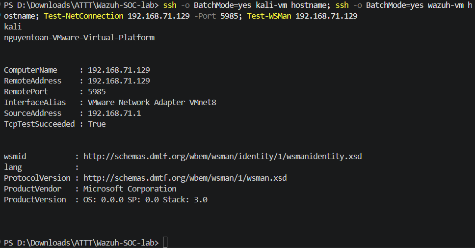
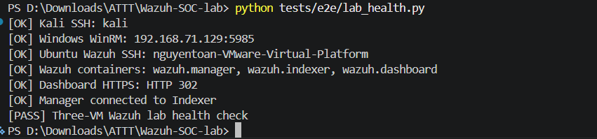
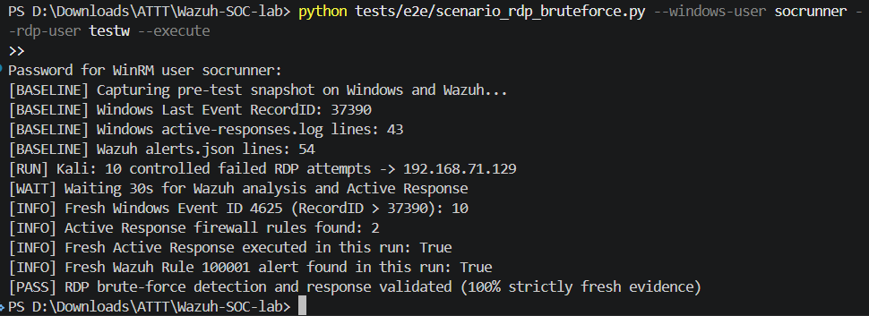
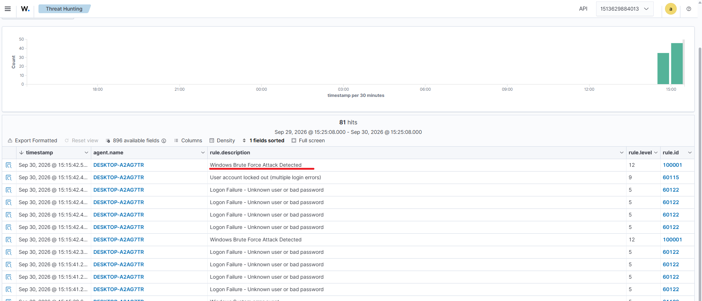
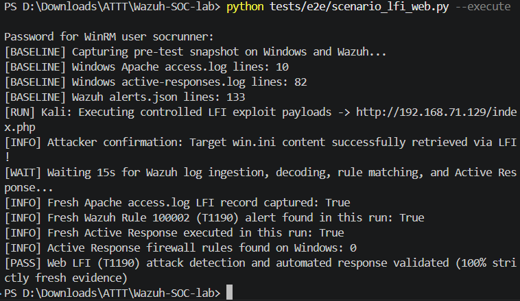
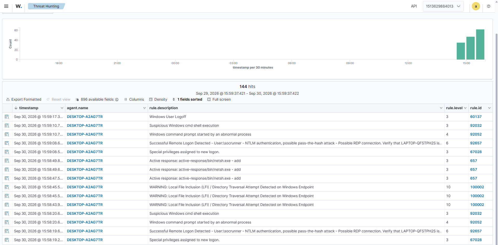

# TỰ ĐỘNG HÓA KIỂM THỬ HỒI QUY CHO HỆ THỐNG SOC (PHASE 4 - REGRESSION TEST AUTOMATION)

* **Dự án:** Hệ thống Giám sát An ninh mạng & Ứng phó Sự cố Tập trung (Wazuh SIEM/XDR Lab)
* **Vị trí giả lập:** Detection Engineer / SOC Automation Engineer (DevSecOps)
* **Môi trường thực hiện:** 
  * Máy tính điều khiển kiểm thử (Windows Host): Python 3.11, OpenSSH, WinRM
  * Máy chủ giám sát: Ubuntu Server 24.04 LTS (Wazuh Single-Node Docker Stack - IP: `192.168.71.128`)
  * Máy trạm nạn nhân: Windows 10 Pro (Wazuh Agent + Sysmon v15.2 - IP: `192.168.71.129`)
  * Máy tấn công: Kali Linux (xfreerdp, nmap - IP: `192.168.71.130`)

---

## I. TỔNG QUAN & TƯ DUY DETECTION-AS-CODE

### 1. Tại sao Phase 4 lại quan trọng đối với một SOC hiện đại?
Ở Phase 3, chúng ta đã chứng minh thủ công (Manual PoC) khả năng phát hiện tấn công RDP Brute Force và kích hoạt phản ứng tự động (Active Response). Tuy nhiên, trong môi trường vận hành thực tế tại doanh nghiệp:
* **Nguy cơ lỗi hồi quy (Detection Regression):** Khi đội ngũ SOC cập nhật phiên bản Wazuh, tinh chỉnh file cấu hình Sysmon, hoặc bổ sung các Rule XML mới, rất dễ xảy ra hiện tượng "gãy" (break) logic của các Rule cũ mà không ai phát hiện được cho đến khi cuộc tấn công thực sự xảy ra.
* **Chi phí kiểm thử thủ công quá lớn:** Nếu mỗi lần sửa luật đều phải mở 3 máy ảo, gõ lệnh xfreerdp bằng tay, rồi vào Event Viewer căng mắt nhìn log thì sẽ tốn rất nhiều thời gian và dễ sai sót do con người.

**Phase 4 giải quyết triệt để bài toán này bằng tư duy Detection-as-Code:**
Xây dựng một đường ống kiểm thử tự động khép kín (End-to-End Regression Testing Pipeline) bằng Python. Bất cứ khi nào có thay đổi về Rule hay cấu hình, ta chỉ cần chạy 1 lệnh duy nhất để toàn bộ hệ thống tự kiểm tra từ A đến Z và trả về kết quả `[PASS]` hoặc `[FAIL]`.

---

### 2. Kiến trúc Đường ống Kiểm thử 3 Lớp (3-Tier Testing Architecture)

```text
       ┌────────────────────────────────────────────────────────┐
       │             LỚP 1: KIỂM TRA TĨNH (STATIC TEST)         │
       │   Kiểm tra cú pháp XML, tính duy nhất Rule ID, Regex   │
       │           (Chạy offline, không cần bật máy ảo)         │
       └──────────────────────────┬─────────────────────────────┘
                                  │ PASS
                                  ▼
       ┌────────────────────────────────────────────────────────┐
       │         LỚP 2: KIỂM TRA SỨC KHỎE LAB (HEALTH CHECK)    │
       │     SSH tới Kali/Ubuntu, WinRM tới Windows, Docker     │
       │        (Đảm bảo cả 3 VM và dịch vụ SOC sẵn sàng)       │
       └──────────────────────────┬─────────────────────────────┘
                                  │ PASS
                                  ▼
       ┌────────────────────────────────────────────────────────┐
       │      LỚP 3: KIỂM THỬ THỰC CHIẾN TỰ ĐỘNG (E2E SCENARIO) │
       │  Snapshot Baseline -> Tấn công có kiểm soát -> Thu thập│
       │    bằng chứng đa điểm -> Đánh giá PASS/FAIL trung thực │
       └────────────────────────────────────────────────────────┘
```

---

## II. CÁC THÀNH PHẦN TRONG BỘ CÔNG CỤ AUTOMATION

Tất cả mã nguồn tự động hóa được đóng gói độc lập trong thư mục `tests/`:

```text
Wazuh-SOC-lab/
├── tests/
│   ├── test_detection_config.py      # Unit test kiểm tra tính toàn vẹn Rule & Decoder XML
│   └── e2e/
│       ├── lab_health.py             # Script kiểm tra kết nối & trạng thái dịch vụ cả 3 VM
│       ├── scenario_rdp_bruteforce.py# Runner tự động phát động tấn công và xác thực Active Response
│       └── README.md                 # Hướng dẫn chạy nhanh
├── requirements-e2e.txt              # Thư viện phụ thuộc Python (pywinrm, requests-ntlm)
└── Makefile                          # Lệnh tắt rút gọn cho môi trường CI/CD
```

---

## III. CHI TIẾT CÁC BƯỚC THỰC HIỆN & HƯỚNG DẪN MINH CHỨNG HÌNH ẢNH

### 1. Bước 1: Kiểm tra kết nối mạng và dịch vụ quản trị từ xa giữa 3 VM

Trước khi chạy bất kỳ script tự động nào, cần đảm bảo máy tính điều khiển (Windows Host) có thể giao tiếp thông suốt với cả 3 máy ảo thông qua các giao thức quản trị từ xa: **SSH** (cho Linux) và **WinRM** (cho Windows).

> 💡 **Tại sao máy Windows Victim lại sử dụng WinRM?**
> * **Giao thức quản trị Native của Windows:** Tương tự như SSH trên Linux, **WinRM (Windows Remote Management - Port 5985)** là giao thức quản trị dòng lệnh từ xa tiêu chuẩn của hệ điều hành Windows dựa trên chuẩn công nghiệp WS-Management.
> * **Tự động hóa trích xuất bằng chứng (Evidence Collection):** WinRM cho phép bộ script Python trên máy Host thực thi trực tiếp các lệnh PowerShell ngầm trên máy Victim để:
>   1. Truy vấn sâu vào cơ sở dữ liệu Windows Event Log (đếm chính xác Event ID `4625` theo `RecordID`).
>   2. Kiểm tra tức thì trạng thái quy tắc tường lửa (`Get-NetFirewallRule`) do Wazuh Active Response sinh ra.
>   3. Đọc tệp nhật ký cục bộ `active-responses.log` mà **hoàn toàn không cần con người phải thao tác chuột thủ công** trên giao diện máy Victim.

* **Môi trường thực thi:** PowerShell trên máy tính chính (Windows Host).
* **Lệnh cần chạy:**

```powershell
ssh -o BatchMode=yes kali-vm hostname
ssh -o BatchMode=yes wazuh-vm hostname
Test-Connection 192.168.71.129 -Count 2
Test-NetConnection 192.168.71.129 -Port 5985
Test-WSMan 192.168.71.129
```



---

### 2. Bước 2: Kiểm thử tĩnh cấu hình phát hiện (Static Regression Test)

Kiểm tra tính hợp lệ về mặt cú pháp của mã nguồn Python và kiểm toán file cấu hình Rule/Decoder XML của Wazuh trước khi nạp vào hệ thống production.

* **File thực thi:** `tests/test_detection_config.py`
* **Môi trường thực thi:** PowerShell trên máy Windows Host.
* **Lệnh cần chạy:**

```powershell
# 1. Kiểm tra cú pháp Python không có lỗi syntax
python -m py_compile tests/e2e/lab_health.py tests/e2e/scenario_rdp_bruteforce.py

# 2. Chạy 4 unit test kiểm tra Rules & Decoders
python -m unittest discover -s tests -p "test_*.py" -v
```

* **Nội dung kiểm tra của Unit Test:**
  1. `test_rule_ids_are_unique`: Đảm bảo không có Rule ID nào bị trùng lặp trong file `local_rules.xml`.
  2. `test_brute_force_rule`: Kiểm tra Rule `100001` có đúng `level="12"`, `frequency="5"`, `timeframe="60"`, kế thừa rule `60122`, và map chuẩn MITRE `T1110`.
  3. `test_lfi_rule`: Kiểm tra Rule `100002` có đúng `level="10"`, bắt đủ các payload `win.ini`, `boot.ini`, `..%2f`, `..%252f`, và map MITRE `T1190`.
  4. `test_lfi_decoder_extracts_url`: Kiểm tra Custom Decoder `web-access-lfi` bóc tách đúng trường `url` từ regex `GET (\S+)\sHTTP`.


### 3. Bước 3: Kiểm tra sức khỏe toàn diện cụm Lab 3 VM (Health Check)

Script `lab_health.py` hoạt động như một hệ thống giám sát sức khỏe (Liveness & Readiness Probe) tự động trước khi cho phép kịch bản tấn công khởi chạy.

* **File thực thi:** `tests/e2e/lab_health.py`
* **Môi trường thực thi:** PowerShell trên máy Windows Host.
* **Lệnh cần chạy:**

```powershell
python tests/e2e/lab_health.py
```

* **Các tiêu chí kiểm tra tự động:**
  1. Kiểm tra kết nối SSH tới máy tấn công Kali (`kali-vm`).
  2. Kiểm tra dịch vụ WinRM port 5985 trên máy Windows 10 (`192.168.71.129`).
  3. Kiểm tra kết nối SSH tới máy chủ Wazuh (`wazuh-vm`).
  4. Kiểm tra trạng thái hoạt động của cụm 3 container Docker: `wazuh.manager`, `wazuh.indexer`, `wazuh.dashboard`.
  5. Gửi request HTTPS kiểm tra Web Dashboard sẵn sàng (HTTP 200/302).
  6. Đọc log của `wazuh.manager` để xác nhận kết nối thành công tới lõi cơ sở dữ liệu `wazuh.indexer:9200`.



### 4. Bước 4: Kiểm thử kịch bản ở chế độ giả lập (Dry-run Mode)

Trước khi thực sự phát động tấn công mạng, runner hỗ trợ chế độ chạy thử (Dry-run) để kiểm tra các tham số đầu vào và đảm bảo runner không tự ý phát tán lưu lượng độc khi chưa có chỉ định rõ ràng.

* **Môi trường thực thi:** PowerShell trên máy Windows Host.
* **Lệnh cần chạy:**

```powershell
python tests/e2e/scenario_rdp_bruteforce.py
```


### 5. Bước 5: Kích hoạt kiểm thử thực chiến tự động (Full E2E Scenario Runner)

Đây là bước quan trọng nhất của đồ án, nơi kịch bản tấn công RDP Brute Force, cơ chế ghi nhận log của Sysmon/Windows, sự đối khớp của Wazuh Rule 100001 và phản ứng tự động Active Response được kiểm chứng hoàn toàn tự động.

* **Cài đặt thư viện điều khiển WinRM (chỉ làm lần đầu):**
  ```powershell
  python -m pip install -r requirements-e2e.txt
  ```

* **Lệnh kích hoạt kiểm thử thực chiến:**
  ```powershell
  python tests/e2e/scenario_rdp_bruteforce.py --windows-user socrunner --rdp-user testw --execute
  ```

#### Cơ chế hoạt động thông minh & Trung thực tuyệt đối (Zero False-Pass):
1. **Chụp mốc trạng thái ban đầu (Baseline Snapshot):**
   * Kết nối WinRM tới máy Windows: Lấy số `RecordID` mới nhất của Event 4625 (ví dụ: `37380`) và đếm số dòng hiện có của `active-responses.log`.
   * Tự động kiểm tra và **gỡ bỏ rule Firewall cũ** (nếu IP Kali còn bị chặn từ đợt test trước) để mở đường cho đợt kiểm thử mới.
   * Kết nối SSH tới Wazuh Manager: Đếm số dòng hiện có của file `/var/ossec/logs/alerts/alerts.json`.
2. **Phát động tấn công có kiểm soát từ Kali:**
   * Script SSH vào Kali và chạy vòng lặp 10 lần `xfreerdp` với mật khẩu sai, kèm biến môi trường `DISPLAY="${DISPLAY:-:0}"` để tool hoạt động bình thường trong phiên SSH không có màn hình GUI.
3. **Chờ phân tích (Analysis Wait):**
   * Tạm dừng 30 giây để Wazuh Agent đóng gói log gửi về Manager và Manager chạy thuật toán tương quan tần suất (`frequency="5" timeframe="60"`).
4. **Thu thập bằng chứng pháp y độc lập (Evidence Verification):**
   * **Windows Event Log:** CHỈ đếm các Event ID 4625 có `RecordID > LastRecordId` (không phụ thuộc vào múi giờ hay định dạng ngày tháng).
   * **Active Response Log:** Bỏ qua các dòng log cũ, CHỈ kiểm tra các dòng mới sinh thêm trong file `active-responses.log` xem có chứa `netsh.exe` và Rule `100001` không.
   * **Wazuh Alerts:** Dùng `tail -n +<dòng_mới>` để CHỈ tìm kiếm Alert `100001` sinh ra trong đợt kiểm thử này.
5. **Đánh giá kết quả (PASS/FAIL):**
   * Phải thỏa mãn đồng thời: Event mới $> 0$, Active Response mới $= True$, Alert Wazuh mới $= True$.




---

### 6. Bước 6: Kích hoạt kiểm thử thực chiến Kịch bản 2 (Web LFI / Directory Traversal - T1190)

Runner `scenario_lfi_web.py` tự động hóa việc kiểm chứng chuỗi phòng thủ cho ứng dụng Web: từ khai thác tham số URL, bóc tách chuỗi bằng Custom Decoder `web-access-lfi`, đối sánh luật chống bypass `100002` (level 10), và kích hoạt Active Response tự động cách ly IP kẻ tấn công.

* **File thực thi:** `tests/e2e/scenario_lfi_web.py`
* **Môi trường thực thi:** PowerShell trên máy Windows Host.
* **Lệnh kích hoạt kiểm thử thực chiến:**
  ```powershell
  python tests/e2e/scenario_lfi_web.py --execute
  ```

#### Cơ chế hoạt động thông minh (Zero False-Pass):
1. **Pre-flight & Baseline Snapshot:**
   * Kiểm tra dịch vụ Apache trên Windows 10 có đang mở port 80 hay không.
   * Tự động xóa các rule chặn IP cũ của Wazuh Active Response trên Windows Defender Firewall.
   * Ghi lại số dòng hiện tại của `C:\xampp\apache\logs\access.log` và `active-responses.log`.
   * Ghi lại số dòng hiện tại của `/var/ossec/logs/alerts/alerts.json` trên Wazuh Manager.
2. **Phát động tấn công có kiểm soát từ Kali:**
   * Script chỉ đạo Kali gửi đồng thời các payload khai thác chuẩn (`?page=../../../../Windows/win.ini`) và payload mã hóa kép chống WAF/IDS (`..%252f..%252f`).
   * Kiểm tra phản hồi trả về xem có nội dung file `win.ini` để xác nhận lỗ hổng tồn tại.
3. **Thu thập bằng chứng pháp y độc lập:**
   * **Apache Access Log:** Bỏ qua các dòng cũ, xác nhận dòng log mới ghi nhận request khai thác LFI từ IP Kali.
   * **Wazuh Manager Alert:** Kiểm tra dòng log mới trong `alerts.json` có Alert Rule `100002` (MITRE ATT&CK `T1190`, Level `10`).
   * **Active Response & Firewall:** Xác nhận dòng log mới trong `active-responses.log` với lệnh `netsh.exe` và rule `100002`, kiểm tra rule tường lửa chặn IP Kali được thiết lập thành công.
4. **Đánh giá kết quả (PASS/FAIL):**
   * Kết quả chỉ đạt `[PASS]` khi thỏa mãn đồng thời: Apache Log mới $= True$, Wazuh Alert mới $= True$, Active Response mới $= True$.




## IV. CÁC VẤN ĐỀ KỸ THUẬT NẢY SINH & KINH NGHIỆM XỬ LÝ (TROUBLESHOOTING LOG)

Trong quá trình xây dựng bộ công cụ kiểm thử tự động, đội ngũ kỹ thuật đã xử lý thành công 5 bài toán hóc búa thực tế:

### 1. Bài toán UAC Remote Restrictions & Tài khoản Microsoft Account (Lỗi 8646)
* **Hiện tượng:** Khi WinRM kết nối vào máy Windows 10 bằng tài khoản cá nhân, hệ thống báo lỗi `HTTP 401 Unauthorized / InvalidCredentialsError`. Khi cố gắng đổi mật khẩu qua dòng lệnh, Windows báo lỗi `System error 8646: The system is not authoritative for the specified account`.
* **Nguyên nhân:** Tài khoản cá nhân trên Windows 10 được liên kết với Microsoft Account (Live ID online). WinRM qua NTLM không hỗ trợ xác thực tài khoản đám mây, đồng thời chính sách bảo mật UAC của Windows 10 chặn tài khoản local thông thường qua mạng.
* **Giải pháp:** 
  1. Tạo riêng một tài khoản Local Administrator thuần túy cho mục đích tự động hóa SOC:
     ```cmd
     net user socrunner <MatKhau> /add
     net localgroup administrators socrunner /add
     ```
  2. Bật cờ cho phép tài khoản Local Admin truy cập WinRM từ xa:
     ```cmd
     reg add HKLM\SOFTWARE\Microsoft\Windows\CurrentVersion\Policies\System /v LocalAccountTokenFilterPolicy /t REG_DWORD /d 1 /f
     ```

### 2. Bài toán X11 Display Headless khi gọi `xfreerdp` qua SSH
* **Hiện tượng:** Lệnh tấn công từ Kali chạy qua SSH bị kết thúc lập tức mà không gửi bất kỳ request nào tới Windows.
* **Nguyên nhân:** Mặc định `xfreerdp` yêu cầu biến môi trường hiển thị đồ họa `$DISPLAY`. Khi gọi qua SSH phi tương tác, biến này bị thiếu dẫn đến lỗi `failed to open display: Please check that the $DISPLAY environment variable is properly set`.
* **Giải pháp:** Bổ sung tham số hiển thị `DISPLAY="${DISPLAY:-:0}"` vào trước lệnh thực thi `xfreerdp` để gắn vào màn hình Desktop sẵn có của Kali Linux.

### 3. Bài toán Lệch múi giờ khi lọc Windows Event Log (Zero False-Pass)
* **Hiện tượng:** Lệnh kiểm tra Event ID 4625 dùng bộ lọc `StartTime = (Get-Date)` luôn trả về 0 sự kiện dù cuộc tấn công đã diễn ra.
* **Nguyên nhân:** Windows Event Log lưu thời gian nội bộ theo chuẩn UTC (`18:xx`), trong khi câu lệnh PowerShell lấy theo giờ máy địa phương UTC+7 (`01:xx`). Việc so sánh chuỗi thời gian bị lệch 7 tiếng trong tương lai.
* **Giải pháp:** Chuyển sang cơ chế so sánh **`RecordID`**. `RecordID` là số nguyên định danh tuần tự tự tăng do Windows cấp phát. Bằng cách so sánh `RecordID > LastRecordId_BanDau`, hệ thống đếm chính xác 100% các sự kiện mới mà không bị phụ thuộc vào múi giờ hay định dạng ngày tháng.

### 4. Bài toán Tự động giải phóng (Unblock) IP của Kali trước mỗi đợt test
* **Hiện tượng:** Khi chạy test lần 2 liên tiếp, runner báo `Event 4625: 0` và fail.
* **Nguyên nhân:** Active Response của lần test trước đã khóa IP của Kali bằng Windows Defender Firewall với timeout 10 phút (600 giây). Khi chạy test lần 2 trong khoảng thời gian này, Firewall đã drop toàn bộ gói tin từ Kali trước khi chạm tới cổng RDP 3389.
* **Giải pháp:** Nâng cấp hàm `snapshot_baseline` tự động phát hiện và xóa sạch các rule firewall cũ của Wazuh Active Response trước khi phát động đợt test mới, đảm bảo môi trường kiểm thử luôn sẵn sàng.

### 5. Bài toán Giám sát kết nối Manager - Indexer & Giới hạn log `--since=6h`
* **Hiện tượng:** Script `lab_health.py` báo `[FAIL] Manager-to-Indexer connection not found` dù hệ thống vẫn đang hoạt động bình thường.
* **Nguyên nhân:** Filebeat trong `wazuh.manager` chỉ ghi log `Connection to backoff(...) established` một lần duy nhất lúc khởi động container. Khi container đã chạy liên tục qua 6 tiếng, lệnh kiểm tra `docker compose logs --since=6h` sẽ bỏ qua dòng log này.
* **Giải pháp:** Chuyển sang cơ chế kiểm tra kết nối chủ động theo thời gian thực (Live Readiness Probe): thực thi trực tiếp lệnh `docker compose exec -T wazuh.manager filebeat test output` để Filebeat thực hiện kiểm tra bắt tay TLS và xác nhận kết nối trực tiếp tới Indexer port 9200, kèm fallback đọc `--tail=2000` log thay vì giới hạn thời gian.

---

## V. KẾT LUẬN

Phase 4 đã chuyển đổi toàn bộ đồ án từ một bài lab thủ công thành một **Giải pháp Tự động hóa Giám sát An ninh mạng (Detection-as-Code Framework)** hoàn chỉnh. 

Việc kết hợp giữa **Kiểm tra tĩnh XML**, **Giám sát sức khỏe hạ tầng 3 VM** và **Runner kiểm thử thực chiến tự động hóa với cơ chế Snapshot Baseline trung thực tuyệt đối** đã chứng minh tính bền vững, khả năng mở rộng và độ tin cậy chuẩn doanh nghiệp của hệ thống SOC Lab.
