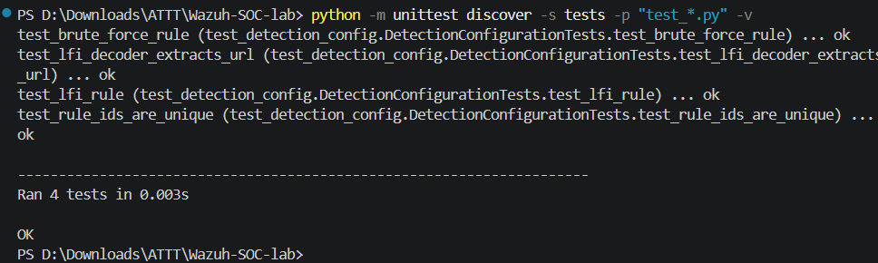
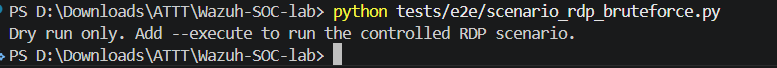

# TỰ ĐỘNG HÓA REGRESSION TEST CHO SOC LAB (PHASE 4)

Phase 3 đã chứng minh thủ công khả năng phát hiện RDP Brute Force và Active Response. Phase 4 không lặp lại PoC thủ công; Phase 4 xây dựng regression automation để kiểm tra lại hệ thống sau mỗi thay đổi.

```text
Static Rule/Decoder test
        ->
Three-VM health check
        ->
Python Scenario 1 runner
        ->
PASS/FAIL result
```

## 1. Thành phần automation

```text
tests/test_detection_config.py
  Kiểm tra Rule/Decoder offline

tests/e2e/lab_health.py
  SSH tới Kali/Ubuntu, WinRM tới Windows, kiểm tra Wazuh

tests/e2e/scenario_rdp_bruteforce.py
  Tự chạy controlled RDP test và xác nhận bằng chứng
requirements-e2e.txt
Makefile
```

Runner mặc định dùng:

```text
WinRM user: .\socrunner
RDP test user: regression-test
```

Không lưu password trong repository.

## 2. Kiểm tra kết nối

Trên máy Windows chính:

```powershell
ssh -o BatchMode=yes kali-vm hostname
ssh -o BatchMode=yes wazuh-vm hostname
Test-Connection 192.168.71.129 -Count 2
Test-NetConnection 192.168.71.129 -Port 5985
Test-WSMan 192.168.71.129
```

Kết quả cần có hostname Kali/Ubuntu, `TcpTestSucceeded : True` và output WS-Man.


## 3. Static regression test

```powershell
python -m py_compile tests/e2e/lab_health.py tests/e2e/scenario_rdp_bruteforce.py
python -m unittest discover -s tests -p "test_*.py" -v
```

Kết quả:

```text
Ran 4 tests
OK
```



## 4. Three-VM health check

```powershell
python tests/e2e/lab_health.py
```

Kết quả đạt:

```text
[OK] Kali SSH
[OK] Windows WinRM
[OK] Ubuntu Wazuh SSH
[OK] Wazuh containers
[OK] Dashboard HTTPS
[OK] Manager connected to Indexer
[PASS] Three-VM Wazuh lab health check
```


Nếu health check fail thì không chạy Scenario 1.

## 5. Automated Scenario 1 regression test

Dry-run:

```powershell
python tests/e2e/scenario_rdp_bruteforce.py
```



Cài dependency và chạy thật trong mạng lab cô lập:

```powershell
python -m pip install -r requirements-e2e.txt
python tests/e2e/scenario_rdp_bruteforce.py --execute
```

Runner tự động:

1. SSH vào Kali và tạo 10 RDP failures.
2. Chờ Wazuh phân tích.
3. Dùng WinRM đếm Event ID `4625`.
4. Kiểm tra `active-responses.log` có `netsh.exe`, Rule `100001` và `continue`.
5. SSH vào Ubuntu kiểm tra Rule `100001`.
6. Trả `PASS/FAIL`.

Kết quả đạt:

```text
[INFO] Windows Event ID 4625 in last 15 minutes: <number greater than 0>
[INFO] Active Response executed: True
[INFO] Wazuh Rule 100001 alert found: True
[PASS] RDP brute-force detection and response validated
```


Firewall rule có thể đã tự xóa sau timeout 600 giây; runner dùng Agent `active-responses.log` để xác nhận Active Response đã thực thi.

## 6. Phân biệt Phase 3 và Phase 4

| Nội dung | Report |
|---|---|
| PoC tấn công thủ công, Event Viewer, Dashboard chi tiết, firewall UI | Phase 3 |
| Static Rule/Decoder test | Phase 4 |
| Health check ba VM | Phase 4 |
| Python regression runner | Phase 4 |
| PASS/FAIL sau mỗi lần chạy | Phase 4 |

## 7. Kết luận

Phase 3 chứng minh Wazuh hoạt động. Phase 4 chứng minh chuỗi phát hiện và phản ứng có thể được kiểm tra lại tự động, nhanh chóng và nhất quán sau mỗi lần thay đổi.
